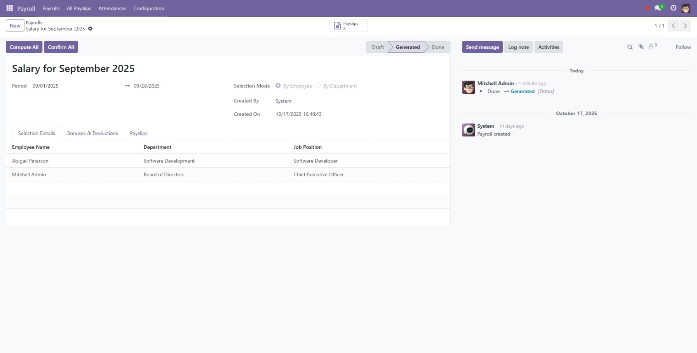
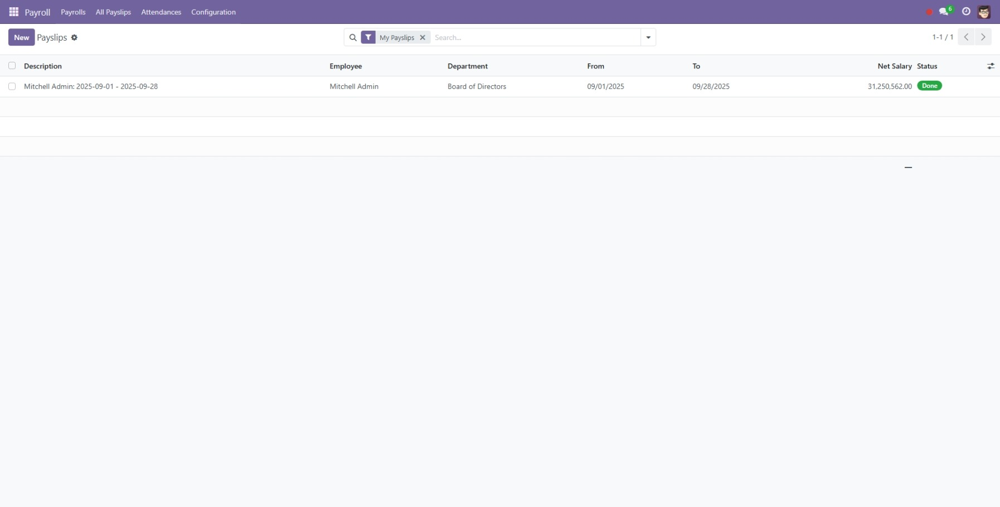

# Quản lý Nguồn nhân lực (Human Resources Management) cho Odoo 17


Đây là một bộ 3 module Odoo 17 được xây dựng để cung cấp một giải pháp quản lý nhân sự cơ bản và toàn diện. Bộ module này được thiết kế theo từng chức năng riêng biệt nhưng tích hợp chặt chẽ với nhau, bao gồm quản lý thông tin nhân viên, nghỉ phép, chấm công và tính lương.

## Các module chính

1.  **HR Management (`hr_management`):** Module nền tảng, quản lý thông tin nhân viên, phòng ban, vị trí công việc và phân quyền.
2.  **Leave Management (`hr_leaves`):** Mở rộng từ `hr_management`, quản lý toàn bộ quy trình nghỉ phép.
3.  **Payroll & Attendance (`payroll_attendance`):** Tích hợp chấm công và quy trình tính lương tự động dựa trên dữ liệu từ hai module trên.

## Tính năng chính

### 👨‍💼 HR Management
- **Hồ sơ nhân viên 360°:** Quản lý chi tiết thông tin công việc, cá nhân, hợp đồng.
- **Cơ cấu tổ chức:** Xây dựng sơ đồ tổ chức dạng cây với các phòng ban và vị trí công việc.
- **Phân quyền 2 cấp (User/Manager):** Hệ thống phân quyền rõ ràng cùng quy trình xin và duyệt quyền minh bạch.
- **Đồng bộ hóa User:** Tự động đồng bộ thông tin giữa hồ sơ nhân viên (`hr.employee`) và tài khoản người dùng (`res.users`).
- **Tự động tạo User:** Tùy chọn tự động tạo tài khoản người dùng cho nhân viên mới.

### 🌴 Leave Management
- **Quản lý Nghỉ phép Toàn diện:** Hỗ trợ nhiều loại nghỉ phép (cần cấp phát, không giới hạn, trả lương, không lương).
- **Tính toán Thời gian Thông minh:** Tự động tính số ngày nghỉ thực tế, loại trừ ngày cuối tuần và ngày lễ chung dựa trên lịch làm việc của từng nhân viên.
- **Quản lý Số dư Phép:** Tự động theo dõi và kiểm tra số ngày phép còn lại khi nhân viên gửi yêu cầu.
- **Luồng phê duyệt:** Quy trình rõ ràng từ gửi yêu cầu, thông báo cho quản lý, đến phê duyệt/từ chối.
- **Lịch nghỉ Tổng quan:** Giao diện lịch trực quan hiển thị ngày nghỉ của nhân viên và ngày lễ của công ty.

###  Attendance & Payroll
- **Chấm công Dễ dàng:** Widget chấm công (Check-in/Check-out) tiện lợi ngay trên thanh công cụ (systray).
- **Tính lương Tự động:** Quy trình tính lương mạnh mẽ, tự động tổng hợp dữ liệu từ chấm công và nghỉ phép.
- **Tính toán Chi tiết:** Tự động tính lương cơ bản, lương làm thêm (OT), lương làm ngày lễ, phụ cấp và các khoản thưởng/phạt.
- **Quản lý Bảng lương:** Cho phép tạo và xử lý phiếu lương hàng loạt cho nhiều nhân viên hoặc phòng ban.
- **Hỗ trợ Đa tiền tệ:** Tính toán bằng tiền tệ cơ sở (USD) và hiển thị bằng một loại tiền tệ khác có thể cấu hình.
- **Xuất báo cáo Excel:** Xuất báo cáo phiếu lương chi tiết ra file Excel chuyên nghiệp.

## Một vài hình ảnh

| Giao diện Danh bạ Nhân viên | Form Yêu cầu Nghỉ phép |
| :---: | :---: |
|  |  |

| Form Bảng lương (Lô) | Danh sách Phiếu lương |
| :---: | :---: |
|  |  |

## Công nghệ sử dụng
- **Backend:** Python 3.10, Odoo 17.0
- **Frontend:** XML (Views), JavaScript (Systray Widget)
- **Database:** PostgreSQL

## Cài đặt

1.  Clone repository này vào thư mục `addons` của bạn.
    ```sh
    git clone https://github.com/nong04/human-resources-management.git /path/to/your/odoo/addons/human-resources-management
    ```
2.  Thêm đường dẫn đến thư mục `human-resources-management` vào `addons_path` trong file cấu hình `odoo.conf` của bạn.
3.  Khởi động lại dịch vụ Odoo.
4.  Truy cập vào Odoo, vào menu **Apps**.
5.  Nhấn **Update Apps List**.
6.  Tìm kiếm và cài đặt lần lượt các module sau:
    - `HR Management` (hr_management)
    - `Leave Management` (hr_leaves)
    - `Payroll Attendance` (payroll_attendance)

## Cấu hình

Sau khi cài đặt, bạn nên cấu hình hệ thống để sử dụng tối ưu.

1.  **HR Management**:
    - Vào `HR Management -> Configuration -> Settings` để bật/tắt tính năng tự động tạo user.
2.  **Leave Management**:
    - Vào `HR Leaves -> Configuration -> Leave Types` để định nghĩa các loại phép.
    - Vào `HR Leaves -> Configuration -> Public Leaves` để thiết lập các ngày lễ chung.
3.  **Payroll & Attendance**:
    - Vào `Payroll -> Configuration -> Settings` để thiết lập tiền tệ hiển thị, tỷ lệ làm thêm và các chính sách khác.
    - Vào `Payroll -> Configuration -> Bonus/Deduction Rules` để định nghĩa các quy tắc lương.
    - Cập nhật hồ sơ của mỗi nhân viên dưới tab "Bảng lương" với `Lương cơ bản` và `Phụ cấp`.

## Hướng dẫn sử dụng
Để xem hướng dẫn chi tiết từng bước, vui lòng tham khảo tài liệu trong thư mục `doc/` của mỗi module:

- [`hr_management/doc/user_guide.md`](hr_management/doc/user_guide.md)
- [`hr_leaves/doc/user_guide.md`](hr_leaves/doc/user_guide.md)
- [`payroll_attendance/doc/user_guide.md`](payroll_attendance/doc/user_guide.md)

## Các module phụ thuộc
- `base`
- `mail`
- `resource`

**Thứ tự phụ thuộc nội bộ:**
`payroll_attendance` -> `hr_leaves` -> `hr_management`

## Giấy phép
Dự án này được cấp phép dưới Giấy phép LGPL-3. Xem chi tiết trong file [LICENSE](LICENSE).

## Tác giả
- **Đỗ Thành Long** - [nong04](https://github.com/nong04)

---

---

# Human Resources Management for Odoo 17


This is a suite of three Odoo 17 modules built to provide a basic yet comprehensive human resources management solution. The suite is designed with separate but tightly integrated functionalities, covering employee information management, leaves, attendance, and payroll.

## Main Modules

1.  **HR Management (`hr_management`):** The foundational module, managing employee information, departments, job positions, and permissions.
2.  **Leave Management (`hr_leaves`):** An extension of `hr_management`, managing the entire leave process.
3.  **Payroll & Attendance (`payroll_attendance`):** Integrates attendance tracking and an automated payroll process based on data from the two modules above.

## Key Features

### 👨‍💼 HR Management
- **360° Employee Profile:** Detailed management of work, personal, and contract information.
- **Organizational Structure:** Build a tree-structured organizational chart with departments and job positions.
- **Two-Tier Permissions (User/Manager):** A clear permission system with a transparent process for requesting and approving rights.
- **User Synchronization:** Automatically synchronizes information between employee profiles (`hr.employee`) and user accounts (`res.users`).
- **Automatic User Creation:** An optional feature to automatically create user accounts for new employees.

### 🌴 Leave Management
- **Comprehensive Leave Management:** Supports multiple leave types (requires allocation, no limit, paid, unpaid).
- **Smart Duration Calculation:** Automatically calculates the actual number of leave days, excluding weekends and public holidays based on each employee's work schedule.
- **Leave Balance Management:** Automatically tracks and validates the remaining leave days when an employee submits a request.
- **Approval Workflow:** A clear process from submitting a request, notifying the manager, to approval/refusal.
- **Leave Overview Calendar:** An intuitive calendar interface displaying employee leaves and company holidays.

###  Attendance & Payroll
- **Easy Attendance Tracking:** A convenient Check-in/Check-out widget directly on the systray.
- **Automated Payroll Calculation:** A powerful payroll process that automatically aggregates data from attendance and leaves.
- **Detailed Computation:** Automatically calculates base pay, overtime (OT) pay, public holiday pay, allowances, and bonuses/deductions.
- **Payroll Management:** Allows creating and processing payslips in batches for multiple employees or departments.
- **Multi-Currency Support:** Performs calculations in a base currency (USD) and displays them in a different configurable currency.
- **Excel Export:** Supports exporting detailed payslip reports to professional Excel files.

## Screenshots

| Employee Directory Interface | Leave Request Form |
| :---: | :---: |
|  |  |

| Payroll Form | Payslip List |
| :---: | :---: |
|  |  |

## Tech Stack
- **Backend:** Python 3.10, Odoo 17.0
- **Frontend:** XML (Views), JavaScript (Systray Widget)
- **Database:** PostgreSQL

## Installation

1.  Clone this repository into your `addons` directory.
    ```sh
    git clone https://github.com/nong04/human-resources-management.git /path/to/your/odoo/addons/human-resources-management
    ```
2.  Add the path to the `human-resources-management` directory to your `addons_path` in your `odoo.conf` file.
3.  Restart the Odoo service.
4.  Navigate to **Apps** in your Odoo instance.
5.  Click **Update Apps List**.
6.  Search for and install the following modules in order:
    - `HR Management` (hr_management)
    - `Leave Management` (hr_leaves)
    - `Payroll Attendance` (payroll_attendance)

## Configuration | Cấu hình

After installation, it is recommended to configure the system for optimal use.

1.  **HR Management**:
    - Go to `HR Management -> Configuration -> Settings` to enable/disable automatic user creation.
2.  **Leave Management**:
    - Go to `HR Leaves -> Configuration -> Leave Types` to define the types of leave your company uses.
    - Go to `HR Leaves -> Configuration -> Public Leaves` to set up company-wide holidays.
3.  **Payroll & Attendance**:
    - Go to `Payroll -> Configuration -> Settings` to set the display currency, overtime rates, and other policies.
    - Go to `Payroll -> Configuration -> Bonus/Deduction Rules` to define salary rules.
    - Update each employee's profile under the "Payroll" tab with their `Base Salary` and `Allowance`.

## Usage
For detailed step-by-step instructions, please refer to the documentation within each module's `doc/` folder:

- [`hr_management/doc/user_guide.md`](hr_management/doc/user_guide.md)
- [`hr_leaves/doc/user_guide.md`](hr_leaves/doc/user_guide.md)
- [`payroll_attendance/doc/user_guide.md`](payroll_attendance/doc/user_guide.md)

## Dependencies
- `base`
- `mail`
- `resource`

**Internal Dependency Order:**
`payroll_attendance` -> `hr_leaves` -> `hr_management`

## License
This project is licensed under the LGPL-3 License. See the [LICENSE](LICENSE) file for details.

## Author
- **Do Thanh Long** - [nong04](https://github.com/nong04)