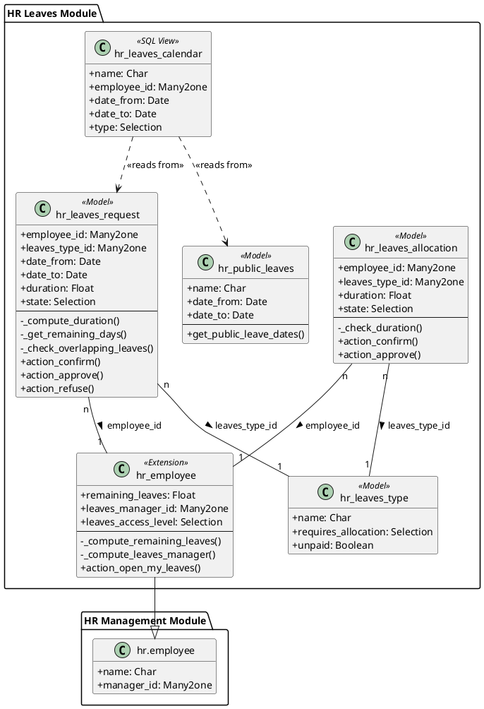

# Mô hình Dữ liệu - Leave Management

Tài liệu này phân tích chi tiết cấu trúc dữ liệu của module **Leave Management**, bao gồm các model, trường dữ liệu, mối quan hệ và các ràng buộc logic.

## 1. Sơ đồ Lớp UML (UML Class Diagram)

Sơ đồ dưới đây minh họa cấu trúc các model trong module `hr_leaves` và mối quan hệ kế thừa (`_inherit`) quan trọng với model `hr.employee` từ module `hr_management`.

**Chú thích:**
- `+` : Thuộc tính/Phương thức công khai (public).
- `-` : Thuộc tính/Phương thức riêng tư (private/protected).
- `<<Model>>`: Biểu thị một model Odoo chuẩn.
- `<<SQL View>>`: Biểu thị một model ảo được tạo từ câu lệnh SQL.

## 2. Mô tả chi tiết các Model

### 2.1. Loại Nghỉ phép (`hr.leaves.type`)

Model cơ sở để định nghĩa các loại nghỉ phép khác nhau trong công ty.

#### Các trường dữ liệu
- `name` (Char): Tên của loại nghỉ phép (ví dụ: "Nghỉ phép năm", "Nghỉ ốm").
- `sequence` (Integer): Thứ tự hiển thị trong danh sách.
- `requires_allocation` (Selection): Xác định loại phép có cần được cấp phát trước hay không.
  - `yes`: Nhân viên phải được cấp phát (allocate) một số ngày nghỉ trước khi có thể yêu cầu.
  - `no`: Nhân viên có thể yêu cầu nghỉ mà không cần cấp phát (ví dụ: nghỉ không lương).
- `unpaid` (Boolean): Đánh dấu nếu đây là loại nghỉ không được trả lương.

#### Ràng buộc Logic & Dữ liệu
- **SQL Constraints (`_sql_constraints`):**
  - `name_uniq`: Tên của mỗi loại nghỉ phép phải là duy nhất.
- **Python Constraints:**
  - Ghi đè phương thức `write` để ngăn chặn việc chỉnh sửa các trường quan trọng (trừ `sequence`) của loại phép đã tồn tại, đảm bảo tính nhất quán dữ liệu lịch sử.

### 2.2. Cấp phát Nghỉ phép (`hr.leaves.allocation`)

Model dùng để cấp phát (phân bổ) một số ngày nghỉ cho nhân viên. Kế thừa `mail.thread` và `mail.activity.mixin`.

#### Các trường dữ liệu
- `name` (Char): Mô tả tự động của yêu cầu cấp phát, được tính toán dựa trên tên nhân viên, loại phép và số ngày.
- `state` (Selection): Trạng thái của quy trình (`draft`, `confirm`, `approved`, `refused`).
- `employee_id` (Many2one -> `hr.employee`): Nhân viên được cấp phát.
- `manager_id` (Many2one -> `hr.employee`): Quản lý trực tiếp của nhân viên (related, store=True).
- `approver_id` (Many2one -> `res.users`): Người chịu trách nhiệm duyệt phép (`leaves_manager_id`) của nhân viên (related, store=True).
- `leaves_type_id` (Many2one -> `hr.leaves.type`): Loại nghỉ phép được cấp phát (chỉ hiển thị các loại có `requires_allocation` = 'yes').
- `duration` (Float): Số ngày được cấp phát.
- `date_from`, `date_to` (Date): Khoảng thời gian hiệu lực của số ngày phép được cấp.
- `reason`, `response` (Text): Lý do cấp phát và phản hồi từ người duyệt.
- `can_approve` (Boolean): Trường tính toán, xác định người dùng hiện tại có quyền duyệt yêu cầu này không (là Leave Manager toàn cục hoặc là `approver_id`).

#### Ràng buộc Logic & Dữ liệu
- **Python Constraints (`@api.constrains`):**
  - `_check_duration`: `duration` phải lớn hơn 0.
- **Logic trong `write`:**
  - Không cho phép chỉnh sửa một yêu cầu đã được `approved` hoặc `refused`.
- **Logic quy trình:**
  - Các phương thức `action_confirm`, `action_approve`, `action_refuse` điều khiển việc chuyển đổi `state` và tạo/phản hồi "Activity" cho người quản lý liên quan.

### 2.3. Yêu cầu Nghỉ phép (`hr.leaves.request`)

Model chính cho phép nhân viên tạo và gửi yêu cầu nghỉ phép. Kế thừa `mail.thread` và `mail.activity.mixin`.

#### Các trường dữ liệu
- `name` (Char): Mô tả tự động của yêu cầu nghỉ phép, được tính toán dựa trên tên nhân viên, loại phép và số ngày.
- `state` (Selection): Trạng thái của quy trình (`draft`, `confirm`, `approved`, `refused`).
- `employee_id` (Many2one -> `hr.employee`): Nhân viên xin nghỉ.
- `manager_id` (Many2one -> `hr.employee`): Quản lý trực tiếp của nhân viên (related, store=True).
- `approver_id` (Many2one -> `res.users`): Người chịu trách nhiệm duyệt phép (`leaves_manager_id`) của nhân viên (related, store=True).
- `leaves_type_id` (Many2one -> `hr.leaves.type`): Loại nghỉ phép muốn xin.
- `date_from`, `date_to` (Date): Ngày bắt đầu và kết thúc nghỉ.
- `duration` (Float): **Trường tính toán quan trọng**, tự động xác định số ngày làm việc thực tế trong khoảng thời gian xin nghỉ.
- `reason`, `response` (Text): Lý do xin nghỉ và phản hồi từ người duyệt.
- `can_approve` (Boolean): Trường tính toán, xác định người dùng hiện tại có quyền duyệt yêu cầu này không (là Leave Manager toàn cục hoặc là `approver_id`).

#### Ràng buộc Logic & Dữ liệu
- **Logic tính `duration` (`_compute_duration`):**
  - Tự động tính toán số ngày dựa trên lịch làm việc (`resource_calendar_id`) và múi giờ (`tz`) của nhân viên.
  - Tự động **loại trừ** các ngày cuối tuần và các ngày nghỉ lễ được định nghĩa trong model `hr.public.leaves`.
- **Logic kiểm tra (`action_confirm`):**
  - **Kiểm tra số dư phép:** Gọi phương thức `_get_remaining_days` để so sánh số ngày xin nghỉ với số ngày phép còn lại (tổng `allocation` - tổng `request` đã duyệt).
  - **Kiểm tra thời gian:** `duration` phải lớn hơn 0 (không thể xin nghỉ vào ngày lễ hoặc cuối tuần).
- **Logic chống trùng lặp (`_check_overlapping_leaves`):**
  - Được gọi khi `create` và `write`.
  - Ngăn chặn một nhân viên có hai yêu cầu nghỉ phép ở trạng thái `approved` bị trùng lặp về thời gian.

### 2.4. Ngày nghỉ Lễ (`hr.public.leaves`)

Model đơn giản để định nghĩa các ngày nghỉ lễ chung của công ty.

#### Các trường dữ liệu
- `name` (Char): Tên ngày lễ (ví dụ: "Tết Nguyên Đán").
- `date_from`, `date_to` (Date): Khoảng thời gian của ngày lễ.

#### Ràng buộc và Phương thức
- **SQL Constraints (`_sql_constraints`):**
  - `date_check`: `date_from` phải nhỏ hơn hoặc bằng `date_to`.
- **Phương thức `get_public_leave_dates`:**
  - Trả về một tập hợp (set) tất cả các ngày nghỉ lễ, được sử dụng bởi model `hr.leaves.request` để tính toán `duration`.

### 2.5. Lịch nghỉ tổng quan (`hr.leaves.calendar`)

Đây là một model ảo (SQL View), không lưu trữ dữ liệu trực tiếp mà tổng hợp thông tin từ các model khác để hiển thị trên lịch.

#### Các trường dữ liệu (chỉ đọc)
- `name` (Char): Tên của sự kiện (tên yêu cầu nghỉ hoặc tên ngày lễ).
- `employee_id` (Many2one -> `hr.employee`): Nhân viên liên quan (chỉ áp dụng cho yêu cầu nghỉ).
- `date_from`, `date_to` (Date): Ngày bắt đầu và kết thúc của sự kiện.
- `type` (Selection): Phân loại sự kiện là `request` (Yêu cầu nghỉ) hay `public` (Ngày lễ).

## 3. Mở rộng Model có sẵn

### Nhân viên (`hr.employee`)
Module `hr_leaves` thêm các trường và chức năng mới vào model `hr.employee` để tích hợp liền mạch.

#### Các trường dữ liệu mới
- `remaining_leaves` (Float): **Trường tính toán**, hiển thị tổng số ngày phép (loại cần cấp phát) còn lại của nhân viên, được tính bằng `(tổng allocation đã duyệt) - (tổng request đã duyệt)`.
- `leaves_manager_id` (Many2one -> `res.users`): Người chịu trách nhiệm duyệt phép cho nhân viên này. Mặc định được tính từ `manager_id` của nhân viên nhưng có thể được ghi đè thủ công.
- `leaves_access_level` (Selection): Cấp độ quyền (`user`, `manager`) trong module Leaves, liên kết với các nhóm quyền của module (`group_hr_leaves_user/manager`).

#### Chức năng mới
- **Smart Button "Leaves":**
  - Thêm một nút bấm trên form nhân viên, hiển thị số ngày phép còn lại.
  - Khi nhấn vào, nút sẽ mở danh sách tất cả các yêu cầu nghỉ phép của nhân viên đó (`action_open_my_leaves`).

#### Ràng buộc Logic & Dữ liệu
- **Logic trong `_inverse_leaves_access_level`: Kiểm tra và cập nhật quyền truy cập của người dùng dựa trên `leaves_access_level`.**
  - Chỉ cho phép cập nhật `leaves_access_level` nếu người dùng hiện tại là Manager hoặc có quyền tương đương.
  - Kiểm tra để không cho phép hạ quyền của Manager cuối cùng trong hệ thống.

---

# Data Model - Leave Management

This document provides a detailed analysis of the data structure of the **Leave Management** module, including models, fields, relationships, and logical constraints.

## 1. UML Class Diagram

The diagram below illustrates the structure of models in the `hr_leaves` module and the important inheritance (`_inherit`) relationship with the `hr.employee` model from the `hr_management` module.

**Legend:**
- `+` : Public attribute/method.
- `-` : Private/protected attribute/method.
- `<<Model>>`: Represents a standard Odoo model.
- `<<SQL View>>`: Represents a virtual model created from an SQL query.

## 2. Detailed Model Descriptions

### 2.1. Leave Type (`hr.leaves.type`)

The base model for defining different types of leave in the company.

#### Data Fields
- `name` (Char): Name of the leave type (e.g., "Annual Leave", "Sick Leave").
- `sequence` (Integer): Display order in the list.
- `requires_allocation` (Selection): Determines if the leave type needs to be allocated beforehand.
  - `yes`: Employees must be allocated a number of leave days before they can request them.
  - `no`: Employees can request leave without prior allocation (e.g., unpaid leave).
- `unpaid` (Boolean): Marks if this is an unpaid leave type.

#### Logic & Data Constraints
- **SQL Constraints (`_sql_constraints`):**
  - `name_uniq`: The name of each leave type must be unique.
- **Python Constraints:**
  - Overrides the `write` method to prevent editing important fields (except `sequence`) of existing leave types, ensuring historical data consistency.

### 2.2. Leave Allocation (`hr.leaves.allocation`)

Model used to allocate a number of leave days to employees. Inherits `mail.thread` and `mail.activity.mixin`.

#### Data Fields
- `name` (Char): Automatic description of the allocation request, computed based on employee name, leave type, and duration.
- `state` (Selection): Workflow state (`draft`, `confirm`, `approved`, `refused`).
- `employee_id` (Many2one -> `hr.employee`): The employee receiving the allocation.
- `manager_id` (Many2one -> `hr.employee`): The employee's direct manager (related, store=True).
- `approver_id` (Many2one -> `res.users`): The person responsible for approving leaves (`leaves_manager_id`) for the employee (related, store=True).
- `leaves_type_id` (Many2one -> `hr.leaves.type`): The allocated leave type (only shows types with `requires_allocation` = 'yes').
- `duration` (Float): The number of days allocated.
- `date_from`, `date_to` (Date): The validity period for the allocated leave days.
- `reason`, `response` (Text): Reason for allocation and the approver's response.
- `can_approve` (Boolean): Computed field, determines if the current user has the right to approve this request (is a global Leave Manager or the `approver_id`).

#### Logic & Data Constraints
- **Python Constraints (`@api.constrains`):**
  - `_check_duration`: `duration` must be greater than 0.
- **Logic in `write`:**
  - Prevents modification of a request that has already been `approved` or `refused`.
- **Workflow Logic:**
  - The `action_confirm`, `action_approve`, `action_refuse` methods control the `state` transition and create/feedback on "Activities" for the relevant manager.

### 2.3. Leave Request (`hr.leaves.request`)

The main model allowing employees to create and submit leave requests. Inherits `mail.thread` and `mail.activity.mixin`.

#### Data Fields
- `name` (Char): Automatic description of the leave request, computed based on employee name, leave type, and duration.
- `state` (Selection): Workflow state (`draft`, `confirm`, `approved`, `refused`).
- `employee_id` (Many2one -> `hr.employee`): The employee requesting leave.
- `manager_id` (Many2one -> `hr.employee`): The employee's direct manager (related, store=True).
- `approver_id` (Many2one -> `res.users`): The person responsible for approving leaves (`leaves_manager_id`) for the employee (related, store=True).
- `leaves_type_id` (Many2one -> `hr.leaves.type`): The requested leave type.
- `date_from`, `date_to` (Date): Start and end dates of the leave.
- `duration` (Float): **A crucial computed field**, automatically determining the number of actual working days in the requested period.
- `reason`, `response` (Text): Reason for the leave and the approver's response.
- `can_approve` (Boolean): Computed field, determines if the current user has the right to approve this request (is a global Leave Manager or the `approver_id`).

#### Logic & Data Constraints
- **`duration` Calculation Logic (`_compute_duration`):**
  - Automatically calculates the number of days based on the employee's working schedule (`resource_calendar_id`) and timezone (`tz`).
  - Automatically **excludes** weekends and public holidays defined in the `hr.public.leaves` model.
- **Validation Logic (`action_confirm`):**
  - **Check Leave Balance:** Calls the `_get_remaining_days` method to compare the requested days with the remaining leave balance (total `allocation` - total approved `request`).
  - **Check Duration:** `duration` must be greater than 0 (cannot request leave on a holiday or weekend).
- **Anti-Overlap Logic (`_check_overlapping_leaves`):**
  - Called on `create` and `write`.
  - Prevents an employee from having two `approved` leave requests that overlap in time.

### 2.4. Public Holiday (`hr.public.leaves`)

A simple model to define the company's general public holidays.

#### Data Fields
- `name` (Char): Name of the holiday (e.g., "New Year's Day").
- `date_from`, `date_to` (Date): The period of the holiday.

#### Constraints and Methods
- **SQL Constraints (`_sql_constraints`):**
  - `date_check`: `date_from` must be less than or equal to `date_to`.
- **Method `get_public_leave_dates`:**
  - Returns a set of all public holiday dates, used by the `hr.leaves.request` model to calculate `duration`.

### 2.5. Leave Overview Calendar (`hr.leaves.calendar`)

This is a virtual model (SQL View) that does not store data directly but aggregates information from other models for display on the calendar.

#### Data Fields (read-only)
- `name` (Char): Name of the event (leave request name or holiday name).
- `employee_id` (Many2one -> `hr.employee`): The related employee (only for leave requests).
- `date_from`, `date_to` (Date): Start and end date of the event.
- `type` (Selection): Classifies the event as a `request` (Leave Request) or `public` (Public Holiday).

## 3. Extending Existing Models

### Employee (`hr.employee`)
The `hr_leaves` module adds new fields and functionalities to the `hr.employee` model for seamless integration.

#### New Data Fields
- `remaining_leaves` (Float): **Computed field**, displays the total remaining leave days (for types requiring allocation) for the employee, calculated as `(total approved allocation) - (total approved requests)`.
- `leaves_manager_id` (Many2one -> `res.users`): The person responsible for approving this employee's leave requests. By default, it's computed from the employee's `manager_id` but can be manually overridden.
- `leaves_access_level` (Selection): Access level (`user`, `manager`) within the Leaves module, linked to the module's user groups (`group_hr_leaves_user/manager`).

#### New Functionality
- **"Leaves" Smart Button:**
  - Adds a button to the employee form that displays the remaining leave days.
  - When clicked, it opens a list of all leave requests for that employee (`action_open_my_leaves`).

#### Logic & Data Constraints
- **Logic in `_inverse_leaves_access_level`: Checks and updates the user's access rights based on `leaves_access_level`.**
  - Only allows updating `leaves_access_level` if the current user is a Manager or has equivalent rights.
  - Prevents demoting the last Manager in the system.