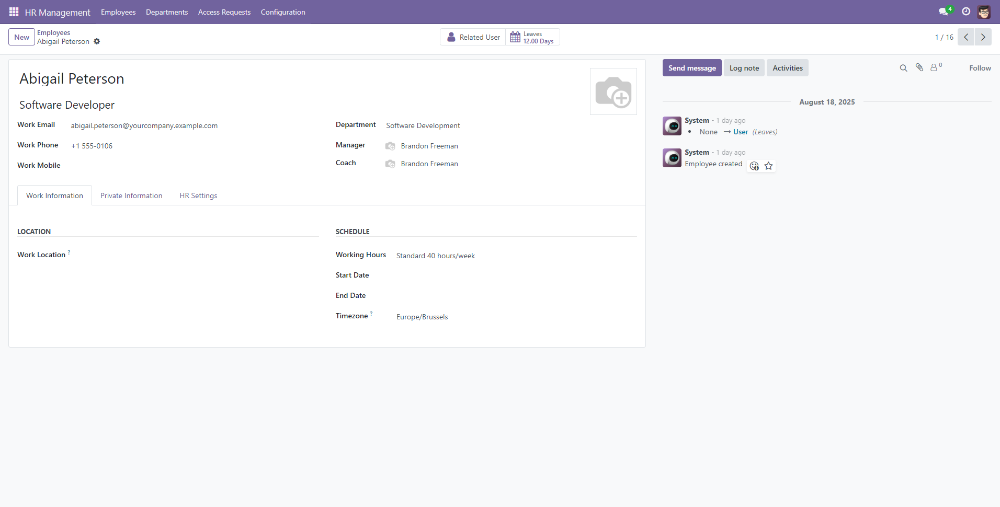
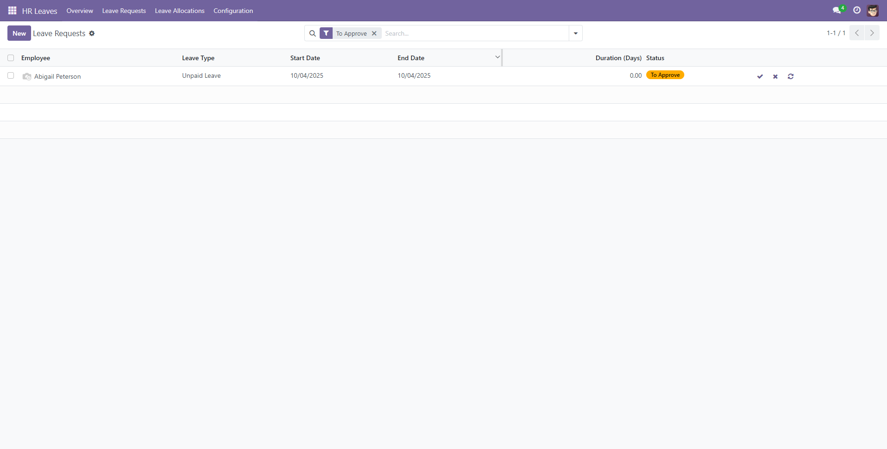

# Hướng dẫn Sử dụng - Leave Management

Tài liệu này cung cấp hướng dẫn chi tiết về các quy trình nghiệp vụ chính trong module **Leave Management**, từ việc cấu hình ban đầu đến việc gửi và phê duyệt yêu cầu nghỉ phép.

## 1. Dành cho Quản lý Nhân sự (HR Manager)

Các bước này thường chỉ cần thực hiện một lần khi thiết lập hệ thống hoặc khi có thay đổi trong chính sách công ty.

### 1.1. Cấu hình các Loại Nghỉ phép

Đầu tiên, bạn cần định nghĩa các loại nghỉ phép mà công ty áp dụng.

1.  **Truy cập:** Vào menu **HR Leaves -> Configuration -> Leave Types**.
2.  **Tạo mới/Sửa:** Giao diện hiển thị dạng danh sách có thể sửa trực tiếp. Nhấn **New** để thêm một loại phép mới.
3.  **Điền thông tin:**
    - **Leave Type:** Tên của loại phép (ví dụ: "Nghỉ phép năm", "Nghỉ ốm", "Nghỉ kết hôn").
    - **Requires Allocation:**
        - Chọn `Yes` nếu đây là loại phép có giới hạn và cần được cấp phát (ví dụ: Nghỉ phép năm).
        - Chọn `No Limit` nếu đây là loại phép không giới hạn (ví dụ: Nghỉ không lương).
    - **Is Unpaid:** Tích vào ô này nếu đây là loại nghỉ không được trả lương.
4.  **Lưu lại.** Lặp lại cho tất cả các loại phép của công ty.

### 1.2. Cấu hình Ngày nghỉ Lễ

Khai báo các ngày nghỉ lễ chung để hệ thống tự động loại trừ khi tính ngày nghỉ.

1.  **Truy cập:** Vào menu **HR Leaves -> Configuration -> Public Leaves**.
2.  **Tạo mới:** Nhấn **New**.
3.  **Điền thông tin:**
    - **Name:** Tên ngày lễ (ví dụ: "Quốc Khánh 2/9").
    - **Start Date** và **End Date:** Chọn ngày bắt đầu và kết thúc của kỳ nghỉ lễ.
4.  **Lưu lại.**

### 1.3. Cấp phát Ngày nghỉ cho Nhân viên (Allocation)

Đối với các loại phép yêu cầu cấp phát (như nghỉ phép năm), bạn cần thực hiện bước này để "nạp" ngày nghỉ cho nhân viên.

1.  **Truy cập:** Vào menu **HR Leaves -> Leave Allocations**.
2.  **Tạo mới:** Nhấn **New**.
3.  **Điền thông tin:**
    - **Employee:** Chọn nhân viên cần cấp phát.
    - **Leave Type:** Chọn loại phép cần cấp (ví dụ: "Nghỉ phép năm").
    - **Duration:** Nhập số ngày phép được cấp (ví dụ: 12).
    - **Validity Period:** Xác định khoảng thời gian hiệu lực cho số ngày phép này (ví dụ: từ 01/01/2024 đến 31/12/2024).
4.  **Lưu và Phê duyệt:**
    - Nhấn **Save**, sau đó nhấn **Submit**.
    - Nhấn **Approve** để chính thức cấp phát ngày nghỉ cho nhân viên.

## 2. Dành cho tất cả Nhân viên

### 2.1. Gửi Yêu cầu Nghỉ phép

Khi có nhu cầu nghỉ, nhân viên có thể dễ dàng tạo yêu cầu trên hệ thống.

1.  **Truy cập:** Vào menu **HR Leaves -> Leave Requests**.
2.  **Tạo mới:** Nhấn **New**.
3.  **Điền thông tin:**
    - **Leave Type:** Chọn loại phép bạn muốn xin.
    - **Dates:** Chọn ngày bắt đầu và ngày kết thúc nghỉ. Hệ thống sẽ tự động tính toán **Duration** (số ngày làm việc thực tế, trừ cuối tuần và ngày lễ).
    - **Reason:** Nhập lý do xin nghỉ.
4.  **Gửi yêu cầu:** Nhấn **Save**, sau đó nhấn **Submit**. Yêu cầu của bạn sẽ được chuyển đến quản lý để chờ phê duyệt.

### 2.2. Theo dõi Yêu cầu và Số dư Phép

-   **Theo dõi trạng thái:** Tại danh sách **Leave Requests**, bạn có thể thấy trạng thái của các yêu cầu của mình (To Approve, Approved, Refused). Sử dụng bộ lọc **My Requests** để xem nhanh.
-   **Kiểm tra số dư phép:**
    1.  Vào menu **HR Management -> Employees**.
    2.  Tìm và mở hồ sơ của bạn.
    3.  Chính giữa cạnh trên của màn hình, nút bấm **Leaves** sẽ hiển thị số ngày phép (loại cần cấp phát) còn lại của bạn.

## 3. Dành cho Quản lý Trực tiếp

### 3.1. Phê duyệt Yêu cầu Nghỉ phép

Quản lý có trách nhiệm xem xét và phản hồi các yêu cầu nghỉ phép từ team của mình.

1.  **Nhận thông báo:** Khi có yêu cầu mới, bạn sẽ nhận được thông báo trong Odoo (qua biểu tượng đồng hồ "Activities").
2.  **Truy cập:** Vào menu **HR Leaves -> Leave Requests**.
3.  **Lọc yêu cầu:** Sử dụng bộ lọc **To Approve** ở thanh tìm kiếm để xem các yêu cầu đang chờ bạn duyệt. Bạn cũng có thể dùng bộ lọc **My Team's Requests** để xem tất cả yêu cầu của team.
4.  **Xem xét và Ra quyết định:**
    - Mở yêu cầu để xem chi tiết (lý do, thời gian, loại phép).
    - Nhấn **Approve** để đồng ý.
    - Nhấn **Refuse** để từ chối. Bạn có thể ghi lý do từ chối vào chatter bên dưới.

### 3.2. Xem Lịch nghỉ của Team

Quản lý có thể xem tổng quan lịch nghỉ của các thành viên để sắp xếp công việc.

1.  **Truy cập:** Vào menu **HR Leaves -> Overview**.
2.  **Xem dạng Lịch:** Giao diện mặc định là lịch tháng.
3.  Lịch sẽ hiển thị các yêu cầu nghỉ phép đã được duyệt của team bạn (màu theo từng nhân viên) và cả các ngày nghỉ lễ chung của công ty. Điều này giúp bạn có cái nhìn tổng quan về sự vắng mặt của các thành viên.

