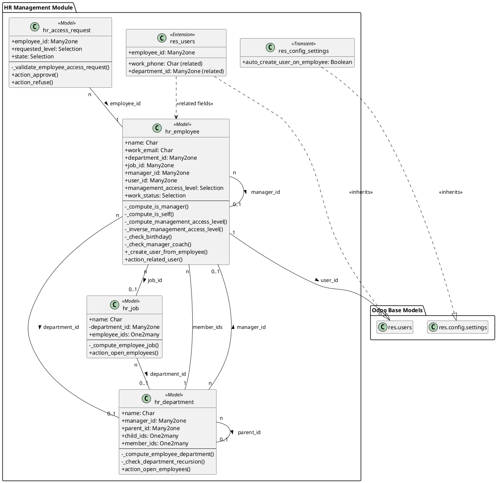

# Mô hình Dữ liệu - HR Management

Tài liệu này phân tích chi tiết cấu trúc dữ liệu của module **HR Management**, bao gồm các model, trường dữ liệu, mối quan hệ và các ràng buộc logic.

## 1. Sơ đồ Lớp UML (UML Class Diagram)

Sơ đồ dưới đây minh họa cấu trúc hướng đối tượng của các model trong module. Nó thể hiện rõ các thuộc tính (fields), phương thức (methods) quan trọng, các mối quan hệ và tính kế thừa.

**Chú thích:**
- `+` : Thuộc tính/Phương thức công khai (public).
- `-` : Thuộc tính/Phương thức riêng tư (private/protected), thường là các hàm `_compute`, `_check`, `_onchange`.
- `<<Model>>`: Biểu thị một model Odoo chuẩn.
- `<<Transient>>`: Biểu thị một model Odoo tạm thời (`models.TransientModel`).

## 2. Mô tả chi tiết các Model

### 2.1. Nhân viên (`hr.employee`)

Model trung tâm lưu trữ hồ sơ nhân sự. Kế thừa từ `mail.thread`, `mail.activity.mixin`, và `resource.mixin`.

#### Các trường dữ liệu
- **Thông tin chung & Công việc:**
  - `name` (Char): Tên nhân viên (liên kết với `resource.resource`).
  - `active` (Boolean): Trạng thái hoạt động (liên kết với `resource.resource`).
  - `image_1920` (Image): Ảnh đại diện.
  - `work_email` (Char): Email công việc.
  - `work_phone`, `work_mobile` (Char): Số điện thoại công việc.
  - `department_id` (Many2one -> `hr.department`): Phòng ban (bắt buộc).
  - `job_id` (Many2one -> `hr.job`): Vị trí công việc (bắt buộc).
  - `manager_id` (Many2one -> `hr.employee`): Quản lý trực tiếp.
  - `coach_id` (Many2one -> `hr.employee`): Người hướng dẫn.
  - `work_location` (Char): Địa điểm làm việc.
  - `work_start_date`, `work_end_date` (Date): Ngày bắt đầu/kết thúc làm việc.
  - `resource_calendar_id` (Many2one -> `resource.calendar`): Lịch làm việc.
  - `tz` (Selection): Múi giờ (liên kết với `resource.resource`).

- **Thông tin cá nhân:**
  - `private_address` (Char): Địa chỉ riêng.
  - `email` (Char): Email cá nhân (bắt buộc).
  - `phone` (Char): Điện thoại cá nhân.
  - `language` (Selection): Ngôn ngữ.
  - `gender` (Selection): Giới tính (`male`, `female`, `other`).
  - `birthday` (Date): Ngày sinh.
  - `nationality` (Many2one -> `res.country`): Quốc tịch.
  - `identification_id`, `passport_id` (Char): Số CCCD/Passport.
  - `certificate`, `study_field`, `study_school` (Char/Selection): Thông tin học vấn.

- **Cài đặt & Phân quyền:**
  - `user_id` (Many2one -> `res.users`): Liên kết đến tài khoản người dùng.
  - `management_access_level` (Selection): Cấp độ quyền trong module (`user`, `manager`).
  - `employee_type` (Selection): Loại nhân viên (`employee`, `contractor`, v.v.).
  - `work_status` (Selection): Trạng thái làm việc (`active`, `left`).

- **Trường tính toán (Compute Fields):**
  - `is_manager` (Boolean): Kiểm tra người dùng hiện tại có phải là Manager không.
  - `is_self` (Boolean): Kiểm tra hồ sơ nhân viên đang xem có phải của chính người dùng hiện tại không.

#### Ràng buộc Logic & Dữ liệu
- **SQL Constraints (`_sql_constraints`):**
  - `work_email_uniq`: `work_email` phải là duy nhất.
  - `user_uniq`: `user_id` phải là duy nhất.
  - `identification_id_uniq`: `identification_id` phải là duy nhất.
- **Python Constraints (`@api.constrains`):**
  - `_check_birthday`: `birthday` không được ở tương lai.
  - `_check_manager_coach`: `manager_id` và `coach_id` không được là chính nhân viên đó.
  - `_check_work_dates`: `work_end_date` phải sau hoặc bằng `work_start_date`.
- **Logic trong `_inverse_management_access_level`: Kiểm tra và cập nhật quyền truy cập của người dùng dựa trên `management_access_level`.**
  - Chỉ cho phép cập nhật `management_access_level` nếu người dùng hiện tại là Manager hoặc có quyền tương đương.
  - Kiểm tra để không cho phép hạ quyền của Manager cuối cùng trong hệ thống.

### 2.2. Phòng ban (`hr.department`)

Model định nghĩa cơ cấu tổ chức. Kế thừa từ `mail.thread`.

#### Các trường dữ liệu
- `name` (Char): Tên phòng ban (bắt buộc).
- `active` (Boolean): Trạng thái hoạt động.
- `manager_id` (Many2one -> `hr.employee`): Trưởng phòng.
- `parent_id` (Many2one -> `hr.department`): Phòng ban cha.
- `parent_path` (Char): Lưu đường dẫn cây để tối ưu truy vấn.
- `child_ids` (One2many -> `hr.department`): Danh sách phòng ban con.
- `member_ids` (One2many -> `hr.employee`): Danh sách nhân viên.
- `employee_department_count` (Integer): Trường tính toán, đếm số lượng nhân viên.

#### Ràng buộc Logic & Dữ liệu
- **Python Constraints (`@api.constrains`):**
  - `_check_department_recursion`: Ngăn chặn tạo vòng lặp đệ quy trong cấu trúc cây.
  - `_check_manager`: `manager_id` phải là một nhân viên có `work_status` là 'active'.

### 2.3. Vị trí Công việc (`hr.job`)

Model định nghĩa các chức danh. Kế thừa từ `mail.thread`.

#### Các trường dữ liệu
- `name` (Char): Tên vị trí (bắt buộc).
- `active` (Boolean): Trạng thái hoạt động.
- `department_id` (Many2one -> `hr.department`): Phòng ban liên quan.
- `employee_ids` (One2many -> `hr.employee`): Danh sách nhân viên giữ vị trí này.
- `employees_job_count` (Integer): Trường tính toán, đếm số lượng nhân viên.

#### Ràng buộc Logic & Dữ liệu
- **SQL Constraints (`_sql_constraints`):**
  - `name_department_uniq`: Cặp (`name`, `department_id`) phải là duy nhất.

### 2.4. Yêu cầu Cấp quyền (`hr.access.request`)

Model quản lý quy trình xin nâng cấp quyền.

#### Các trường dữ liệu
- `employee_id` (Many2one -> `hr.employee`): Nhân viên gửi yêu cầu (bắt buộc).
- `user_id` (Many2one -> `res.users`): User liên quan (tính toán từ `employee_id`).
- `requested_level` (Selection): Cấp độ quyền yêu cầu (`user`, `manager`).
- `state` (Selection): Trạng thái quy trình (`draft`, `confirm`, `approved`, `refused`).

#### Ràng buộc Logic & Dữ liệu
- **Logic trong `create` và `write`:**
  - `_validate_employee_access_request`: Kiểm tra xem nhân viên đã có user chưa, có yêu cầu trùng lặp đang chờ không, và có yêu cầu quyền mà họ đã sở hữu không.
- **Logic trong `action_approve` và `action_refuse`:**
  - `_validate_request_state`: Đảm bảo chỉ các yêu cầu ở trạng thái `confirm` mới có thể được xử lý.
  - Kiểm tra để không cho phép hạ quyền của Manager cuối cùng trong hệ thống.

## 3. Mở rộng Model có sẵn

- **Người dùng (`res.users`):**
  - Thêm nhiều trường `related` trỏ đến `employee_id` để hiển thị và cho phép chỉnh sửa thông tin nhân viên từ form "My Profile".
  - Ghi đè phương thức `write` để kích hoạt đồng bộ hóa dữ liệu hai chiều với `hr.employee`.
- **Cài đặt (`res.config.settings`):**
  - Thêm trường `auto_create_user_on_employee` (Boolean) để lưu cấu hình hệ thống vào `ir.config_parameter`.

---

# Data Model - HR Management

This document provides a detailed analysis of the data structure of the **HR Management** module, including models, fields, relationships, and logical constraints.

## 1. UML Class Diagram

The diagram below illustrates the object-oriented structure of the models in the module. It clearly shows important attributes (fields), methods, relationships, and inheritance.

**Legend:**
- `+` : Public attribute/method.
- `-` : Private/protected attribute/method, typically `_compute`, `_check`, `_onchange` functions.
- `<<Model>>`: Represents a standard Odoo model.
- `<<Transient>>`: Represents a temporary Odoo model (`models.TransientModel`).

## 2. Detailed Model Descriptions

### 2.1. Employee (`hr.employee`)

The central model for storing employee records. Inherits from `mail.thread`, `mail.activity.mixin`, and `resource.mixin`.

#### Data Fields
- **General & Work Information:**
  - `name` (Char): Employee's name (linked to `resource.resource`).
  - `active` (Boolean): Active status (linked to `resource.resource`).
  - `image_1920` (Image): Profile picture.
  - `work_email` (Char): Work email.
  - `work_phone`, `work_mobile` (Char): Work phone numbers.
  - `department_id` (Many2one -> `hr.department`): Department (required).
  - `job_id` (Many2one -> `hr.job`): Job position (required).
  - `manager_id` (Many2one -> `hr.employee`): Direct manager.
  - `coach_id` (Many2one -> `hr.employee`): Coach.
  - `work_location` (Char): Work location.
  - `work_start_date`, `work_end_date` (Date): Start/end date of employment.
  - `resource_calendar_id` (Many2one -> `resource.calendar`): Working schedule.
  - `tz` (Selection): Timezone (linked to `resource.resource`).

- **Personal Information:**
  - `private_address` (Char): Private address.
  - `email` (Char): Private email (required).
  - `phone` (Char): Private phone.
  - `language` (Selection): Language.
  - `gender` (Selection): Gender (`male`, `female`, `other`).
  - `birthday` (Date): Date of birth.
  - `nationality` (Many2one -> `res.country`): Nationality.
  - `identification_id`, `passport_id` (Char): ID/Passport number.
  - `certificate`, `study_field`, `study_school` (Char/Selection): Education information.

- **Settings & Permissions:**
  - `user_id` (Many2one -> `res.users`): Link to the user account.
  - `management_access_level` (Selection): Access level in the module (`user`, `manager`).
  - `employee_type` (Selection): Employee type (`employee`, `contractor`, etc.).
  - `work_status` (Selection): Work status (`active`, `left`).

- **Compute Fields:**
  - `is_manager` (Boolean): Checks if the current user is a Manager.
  - `is_self` (Boolean): Checks if the employee profile being viewed belongs to the current user.

#### Logic & Data Constraints
- **SQL Constraints (`_sql_constraints`):**
  - `work_email_uniq`: `work_email` must be unique.
  - `user_uniq`: `user_id` must be unique.
  - `identification_id_uniq`: `identification_id` must be unique.
- **Python Constraints (`@api.constrains`):**
  - `_check_birthday`: `birthday` cannot be in the future.
  - `_check_manager_coach`: `manager_id` and `coach_id` cannot be the employee themselves.
  - `_check_work_dates`: `work_end_date` must be after or equal to `work_start_date`.
- **Logic in `_inverse_management_access_level`: Checks and updates the user's access rights based on `management_access_level`.**
  - Only allows updating `management_access_level` if the current user is a Manager or has equivalent rights.
  - Prevents demoting the last Manager in the system.

### 2.2. Department (`hr.department`)

Defines the organizational structure. Inherits from `mail.thread`.

#### Data Fields
- `name` (Char): Department name (required).
- `active` (Boolean): Active status.
- `manager_id` (Many2one -> `hr.employee`): Manager of the department.
- `parent_id` (Many2one -> `hr.department`): Parent department.
- `parent_path` (Char): Stores the tree path for query optimization.
- `child_ids` (One2many -> `hr.department`): List of child departments.
- `member_ids` (One2many -> `hr.employee`): List of employees.
- `employee_department_count` (Integer): Computed field, counts the number of employees.

#### Logic & Data Constraints
- **Python Constraints (`@api.constrains`):**
  - `_check_department_recursion`: Prevents creating recursive loops in the tree structure.
  - `_check_manager`: `manager_id` must be an employee with `work_status` = 'active'.

### 2.3. Job Position (`hr.job`)

Defines job titles. Inherits from `mail.thread`.

#### Data Fields
- `name` (Char): Position name (required).
- `active` (Boolean): Active status.
- `department_id` (Many2one -> `hr.department`): Related department.
- `employee_ids` (One2many -> `hr.employee`): List of employees holding this position.
- `employees_job_count` (Integer): Computed field, counts the number of employees.

#### Logic & Data Constraints
- **SQL Constraints (`_sql_constraints`):**
  - `name_department_uniq`: The pair (`name`, `department_id`) must be unique.

### 2.4. Access Request (`hr.access.request`)

Manages the process for requesting elevated permissions.

#### Data Fields
- `employee_id` (Many2one -> `hr.employee`): Employee submitting the request (required).
- `user_id` (Many2one -> `res.users`): Related user (computed from `employee_id`).
- `requested_level` (Selection): Requested access level (`user`, `manager`).
- `state` (Selection): Workflow state (`draft`, `confirm`, `approved`, `refused`).

#### Logic & Data Constraints
- **Logic in `create` and `write`:**
  - `_validate_employee_access_request`: Checks if the employee has a user, if there's a pending duplicate request, and if they are requesting a level they already have.
- **Logic in `action_approve` and `action_refuse`:**
  - `_validate_request_state`: Ensures only requests in the `confirm` state can be processed.
  - Prevents demoting the last Manager in the system.

## 3. Extending Existing Models

- **User (`res.users`):**
  - Adds several `related` fields pointing to `employee_id` to display and allow editing of employee information from the "My Profile" form.
  - Overrides the `write` method to enable two-way data synchronization with `hr.employee`.
- **Settings (`res.config.settings`):**
  - Adds the `auto_create_user_on_employee` (Boolean) field to save the system configuration to `ir.config_parameter`.