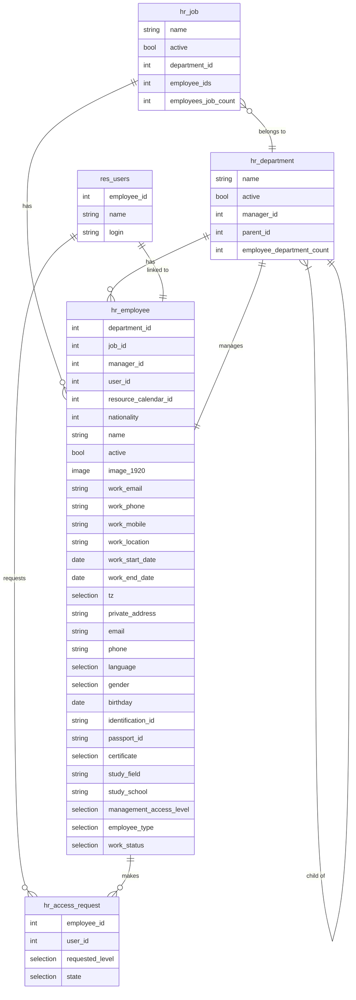

# Mô hình Dữ liệu - HR Management

Tài liệu này phân tích chi tiết cấu trúc dữ liệu của module **HR Management**, bao gồm các model, trường dữ liệu, mối quan hệ và các ràng buộc logic.

## 1. Sơ đồ Quan hệ Dữ liệu (ERD)

*(Sơ đồ này minh họa mối quan hệ giữa các model chính)*

## 2. Mô tả chi tiết các Model

### 2.1. Nhân viên (`hr.employee`)

Model trung tâm lưu trữ hồ sơ nhân sự. Kế thừa từ `mail.thread`, `mail.activity.mixin`, và `resource.mixin`.

#### Các trường dữ liệu
- **Thông tin chung & Công việc:**
  - `name` (Char): Tên nhân viên (liên kết với `resource.resource`).
  - `active` (Boolean): Trạng thái hoạt động (liên kết với `resource.resource`).
  - `image_1920` (Image): Ảnh đại diện.
  - `work_email` (Char): Email công việc.
  - `work_phone`, `work_mobile` (Char): Số điện thoại công việc.
  - `department_id` (Many2one -> `hr.department`): Phòng ban (bắt buộc).
  - `job_id` (Many2one -> `hr.job`): Vị trí công việc (bắt buộc).
  - `manager_id` (Many2one -> `hr.employee`): Quản lý trực tiếp.
  - `coach_id` (Many2one -> `hr.employee`): Người hướng dẫn.
  - `work_location` (Char): Địa điểm làm việc.
  - `work_start_date`, `work_end_date` (Date): Ngày bắt đầu/kết thúc làm việc.
  - `resource_calendar_id` (Many2one -> `resource.calendar`): Lịch làm việc.
  - `tz` (Selection): Múi giờ (liên kết với `resource.resource`).

- **Thông tin cá nhân:**
  - `private_address` (Char): Địa chỉ riêng.
  - `email` (Char): Email cá nhân (bắt buộc).
  - `phone` (Char): Điện thoại cá nhân.
  - `language` (Selection): Ngôn ngữ.
  - `gender` (Selection): Giới tính (`male`, `female`, `other`).
  - `birthday` (Date): Ngày sinh.
  - `nationality` (Many2one -> `res.country`): Quốc tịch.
  - `identification_id`, `passport_id` (Char): Số CCCD/Passport.
  - `certificate`, `study_field`, `study_school` (Char/Selection): Thông tin học vấn.

- **Cài đặt & Phân quyền:**
  - `user_id` (Many2one -> `res.users`): Liên kết đến tài khoản người dùng.
  - `management_access_level` (Selection): Cấp độ quyền trong module (`user`, `manager`).
  - `employee_type` (Selection): Loại nhân viên (`employee`, `contractor`, v.v.).
  - `work_status` (Selection): Trạng thái làm việc (`active`, `left`).

- **Trường tính toán (Compute Fields):**
  - `is_manager` (Boolean): Kiểm tra người dùng hiện tại có phải là Manager không.
  - `is_self` (Boolean): Kiểm tra hồ sơ nhân viên đang xem có phải của chính người dùng hiện tại không.

#### Ràng buộc Logic & Dữ liệu
- **SQL Constraints (`_sql_constraints`):**
  - `work_email_uniq`: `work_email` phải là duy nhất.
  - `user_uniq`: `user_id` phải là duy nhất.
- **Python Constraints (`@api.constrains`):**
  - `_check_birthday`: `birthday` không được ở tương lai.
  - `_check_manager_coach`: `manager_id` và `coach_id` không được là chính nhân viên đó.
  - `_check_work_dates`: `work_end_date` phải sau hoặc bằng `work_start_date`.
- **Logic trong `_inverse_management_access_level`: Kiểm tra và cập nhật quyền truy cập của người dùng dựa trên `management_access_level`.**
  - Chỉ cho phép cập nhật `management_access_level` nếu người dùng hiện tại là Manager hoặc có quyền tương đương.
  - Kiểm tra để không cho phép hạ quyền của Manager cuối cùng trong hệ thống.

### 2.2. Phòng ban (`hr.department`)

Model định nghĩa cơ cấu tổ chức. Kế thừa từ `mail.thread`.

#### Các trường dữ liệu
- `name` (Char): Tên phòng ban (bắt buộc).
- `active` (Boolean): Trạng thái hoạt động.
- `manager_id` (Many2one -> `hr.employee`): Trưởng phòng.
- `parent_id` (Many2one -> `hr.department`): Phòng ban cha.
- `parent_path` (Char): Lưu đường dẫn cây để tối ưu truy vấn.
- `child_ids` (One2many -> `hr.department`): Danh sách phòng ban con.
- `member_ids` (One2many -> `hr.employee`): Danh sách nhân viên.
- `employee_department_count` (Integer): Trường tính toán, đếm số lượng nhân viên.

#### Ràng buộc Logic & Dữ liệu
- **Python Constraints (`@api.constrains`):**
  - `_check_department_recursion`: Ngăn chặn tạo vòng lặp đệ quy trong cấu trúc cây.
  - `_check_manager`: `manager_id` phải là một nhân viên có `work_status` là 'active'.

### 2.3. Vị trí Công việc (`hr.job`)

Model định nghĩa các chức danh. Kế thừa từ `mail.thread`.

#### Các trường dữ liệu
- `name` (Char): Tên vị trí (bắt buộc).
- `active` (Boolean): Trạng thái hoạt động.
- `department_id` (Many2one -> `hr.department`): Phòng ban liên quan.
- `employee_ids` (One2many -> `hr.employee`): Danh sách nhân viên giữ vị trí này.
- `employees_job_count` (Integer): Trường tính toán, đếm số lượng nhân viên.

#### Ràng buộc Logic & Dữ liệu
- **SQL Constraints (`_sql_constraints`):**
  - `name_department_uniq`: Cặp (`name`, `department_id`) phải là duy nhất.

### 2.4. Yêu cầu Cấp quyền (`hr.access.request`)

Model quản lý quy trình xin nâng cấp quyền.

#### Các trường dữ liệu
- `employee_id` (Many2one -> `hr.employee`): Nhân viên gửi yêu cầu (bắt buộc).
- `user_id` (Many2one -> `res.users`): User liên quan (tính toán từ `employee_id`).
- `requested_level` (Selection): Cấp độ quyền yêu cầu (`user`, `manager`).
- `state` (Selection): Trạng thái quy trình (`draft`, `confirm`, `approved`, `refused`).

#### Ràng buộc Logic & Dữ liệu
- **Logic trong `create` và `write`:**
  - `_validate_employee_access_request`: Kiểm tra xem nhân viên đã có user chưa, có yêu cầu trùng lặp đang chờ không, và có yêu cầu quyền mà họ đã sở hữu không.
- **Logic trong `action_approve` và `action_refuse`:**
  - `_validate_request_state`: Đảm bảo chỉ các yêu cầu ở trạng thái `confirm` mới có thể được xử lý.
  - Kiểm tra để không cho phép hạ quyền của Manager cuối cùng trong hệ thống.

## 3. Mở rộng Model có sẵn

- **Người dùng (`res.users`):**
  - Thêm nhiều trường `related` trỏ đến `employee_id` để hiển thị và cho phép chỉnh sửa thông tin nhân viên từ form "My Profile".
  - Ghi đè phương thức `write` để kích hoạt đồng bộ hóa dữ liệu hai chiều với `hr.employee`.
- **Cài đặt (`res.config.settings`):**
  - Thêm trường `auto_create_user_on_employee` (Boolean) để lưu cấu hình hệ thống vào `ir.config_parameter`.