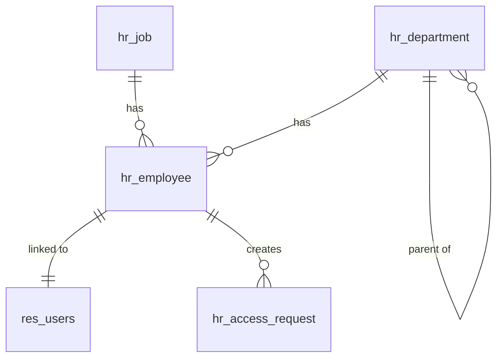

# Tài liệu Mô hình Dữ liệu và Quy trình Sử dụng
# Module: HR Management

## 1. Mục tiêu

Tài liệu này nhằm cung cấp một cái nhìn chi tiết về cấu trúc dữ liệu (models), các mối quan hệ giữa chúng, và hướng dẫn các quy trình nghiệp vụ chính trong module **HR Management**. Tài liệu dành cho quản trị viên hệ thống, người dùng cuối (cấp quản lý và nhân viên), và các nhà phát triển muốn tùy chỉnh hoặc mở rộng module.

---

## 2. Mô hình Dữ liệu (Data Model)

Module xây dựng một hệ thống các đối tượng (models) để lưu trữ và quản lý thông tin nhân sự.

### 2.1. Các Model Chính

#### a. Nhân viên (`hr.employee`)
Đây là model trung tâm, lưu trữ tất cả thông tin liên quan đến một nhân viên.
- **`name`** (Char): Tên đầy đủ của nhân viên.
- **`work_email`** (Char): Email công việc, là trường duy nhất, được dùng để đồng bộ và tạo tài khoản người dùng.
- **`department_id`** (Many2one): Liên kết tới phòng ban mà nhân viên thuộc về (`hr.department`).
- **`job_id`** (Many2one): Liên kết tới vị trí công việc của nhân viên (`hr.job`).
- **`manager_id`** (Many2one): Liên kết tới một nhân viên khác, là quản lý trực tiếp.
- **`user_id`** (Many2one): Liên kết tới tài khoản người dùng (`res.users`) tương ứng.
- **`access_level`** (Selection): Xác định cấp độ truy cập của nhân viên ('User' hoặc 'Manager').
- **`work_status`** (Selection): Trạng thái làm việc ('Active' hoặc 'Left').
- **Các trường thông tin khác:** `work_phone`, `birthday`, `gender`, `nationality`, `identification_id`, v.v.

#### b. Phòng ban (`hr.department`)
Model này định nghĩa cơ cấu tổ chức của công ty.
- **`name`** (Char): Tên phòng ban.
- **`manager_id`** (Many2one): Người quản lý của phòng ban (liên kết tới `hr.employee`).
- **`parent_id`** (Many2one): Phòng ban cha, tạo nên cấu trúc cây.
- **`child_ids`** (One2many): Danh sách các phòng ban con.
- **`member_ids`** (One2many): Danh sách các nhân viên thuộc phòng ban này.
- **`employee_department_count`** (Integer): Trường tính toán, đếm số lượng nhân viên.

#### c. Vị trí Công việc (`hr.job`)
Model này định nghĩa các chức danh trong công ty.
- **`name`** (Char): Tên vị trí công việc (ví dụ: "Software Developer").
- **`department_id`** (Many2one): Phòng ban mà vị trí này thường thuộc về.
- **`employee_ids`** (One2many): Danh sách các nhân viên đang giữ vị trí này.
- **`employees_job_count`** (Integer): Trường tính toán, đếm số lượng nhân viên.

#### d. Yêu cầu Truy cập (`hr.access.request`)
Model tùy chỉnh để quản lý quy trình xin nâng cấp quyền.
- **`employee_id`** (Many2one): Nhân viên gửi yêu cầu.
- **`requested_level`** (Selection): Cấp độ quyền được yêu cầu ('Manager').
- **`state`** (Selection): Trạng thái của yêu cầu ('To Approve', 'Approved', 'Refused').

### 2.2. Sơ đồ Quan hệ Dữ liệu (ERD)

- **Phòng ban (`hr.department`) và Nhân viên (`hr.employee`):**
  - Một phòng ban có thể có nhiều nhân viên.
  - Một nhân viên chỉ thuộc về một phòng ban. (Quan hệ 1-Nhiều)
- **Vị trí Công việc (`hr.job`) và Nhân viên (`hr.employee`):**
  - Một vị trí công việc có thể có nhiều nhân viên đảm nhiệm.
  - Một nhân viên chỉ giữ một vị trí công việc. (Quan hệ 1-Nhiều)
- **Nhân viên (`hr.employee`) và Người dùng (`res.users`):**
  - Một nhân viên được liên kết với tối đa một người dùng.
  - Một người dùng có thể được liên kết với nhiều hồ sơ nhân viên (ở các công ty khác nhau, nhưng trong module này là 1-1). (Quan hệ 1-1)
- **Yêu cầu Truy cập (`hr.access.request`) và Nhân viên (`hr.employee`):**
  - Một nhân viên có thể có nhiều yêu cầu truy cập. (Quan hệ 1-Nhiều)

---

## 3. Quy trình Sử dụng

### Quy trình 1: Quản lý Nhân viên

#### a. Thêm một Nhân viên mới
1.  **Điều hướng:** `HR Management` ‣ `Employees`.
2.  Nhấn nút **New**.
3.  Điền các thông tin bắt buộc:
    - **Employee's Name**: Tên nhân viên.
    - **Job Position**: Vị trí công việc.
    - **Department**: Phòng ban.
4.  Điền các thông tin quan trọng khác:
    - **Work Email**: Bắt buộc nếu muốn tự động tạo user hoặc liên kết sau này.
    - **Manager**: Chọn quản lý trực tiếp.
5.  Nhấn **Save**.
6. **Lưu ý:** Nếu tính năng "Auto-Create User" được bật trong Settings và bạn đã điền "Work Email", một tài khoản người dùng sẽ được tự động tạo và liên kết.

#### b. Chỉnh sửa thông tin Nhân viên
1.  Từ danh sách nhân viên, chọn một nhân viên để mở form view.
2.  Nhấn nút **Edit**.
3.  Thay đổi thông tin cần thiết.
4.  Nhấn **Save**.
5.  **Lưu ý:**
    - Nhân viên cấp `User` chỉ có thể tự sửa thông tin của chính mình.
    - Nhân viên cấp `Manager` có thể sửa thông tin của tất cả mọi người.

### Quy trình 2: Quản lý Phòng ban
1.  **Điều hướng:** `HR Management` ‣ `Departments`.
2.  Nhấn **New** để tạo phòng ban mới.
3.  Điền **Tên phòng ban**, chọn **Quản lý** và **Phòng ban cha** (nếu có).
4.  Nhấn **Save**.
5.  Từ form view của một phòng ban, bạn có thể nhấn vào smart button **Employees** để xem danh sách nhân viên thuộc phòng ban đó.

### Quy trình 3: Quản lý Vị trí Công việc
1.  **Điều hướng:** `HR Management` ‣ `Configuration` ‣ `Job Positions`.
2.  Nhấn **New** để tạo vị trí mới.
3.  Điền **Tên vị trí** và **Phòng ban** (tùy chọn).
4.  Nhấn **Save**.

### Quy trình 4: Xin và Duyệt Quyền Truy cập

Đây là quy trình dành cho việc nâng cấp quyền từ `User` lên `Manager`.

#### a. Nhân viên gửi yêu cầu
1.  **Điều hướng:** `HR Management` ‣ `Access Requests`.
2.  Nhấn **New**.
3.  Hệ thống sẽ tự động chọn nhân viên tương ứng với người dùng đang đăng nhập.
4.  **Requested Level** mặc định là 'Manager'.
5.  Nhấn **Save**. Yêu cầu sẽ được tạo với trạng thái "To Approve".

#### b. Quản lý duyệt yêu cầu
1.  **Điều hướng:** `HR Management` ‣ `Access Requests`.
2.  Quản lý sẽ thấy danh sách các yêu cầu đang ở trạng thái "To Approve".
3.  Trong danh sách, quản lý có thể:
    - Nhấn vào biểu tượng **✔ (Approve)** để đồng ý. Tài khoản người dùng của nhân viên sẽ được thêm vào nhóm `Manager`. Trạng thái yêu cầu chuyển thành "Approved".
    - Nhấn vào biểu tượng **✖ (Refuse)** để từ chối. Trạng thái yêu cầu chuyển thành "Refused".

### Quy trình 5: Cấu hình Module
1.  **Điều hướng:** `HR Management` ‣ `Configuration` ‣ `Settings`.
2.  Tại đây, Quản trị viên hệ thống có thể bật/tắt tùy chọn:
    - **Auto-Create User:** Tích vào ô này và lưu lại để kích hoạt tính năng tự động tạo tài khoản người dùng khi tạo nhân viên mới có email.

---

## 4. Phân quyền Truy cập

Module định nghĩa 2 cấp độ truy cập chính:

| Nhóm quyền | Mô tả |
| :--- | :--- |
| **HR Management / User** | - **Xem:** Danh sách Nhân viên, Phòng ban, Vị trí Công việc. - **Sửa:** Chỉ được sửa thông tin trên hồ sơ của chính mình. - **Tạo/Xóa:** Không được tạo/xóa các đối tượng nhân sự. - **Hành động:** Có thể tạo yêu cầu nâng cấp quyền cho bản thân. |
| **HR Management / Manager** | - Kế thừa tất cả quyền của `User`. - **Toàn quyền (Đọc, Ghi, Tạo, Xóa):** Trên các đối tượng Nhân viên, Phòng ban, Vị trí Công việc. - **Hành động:** Có thể duyệt hoặc từ chối các yêu cầu nâng cấp quyền. Có quyền truy cập menu `Configuration`. |