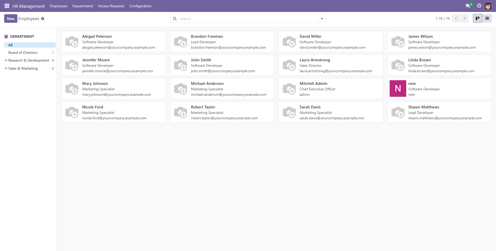
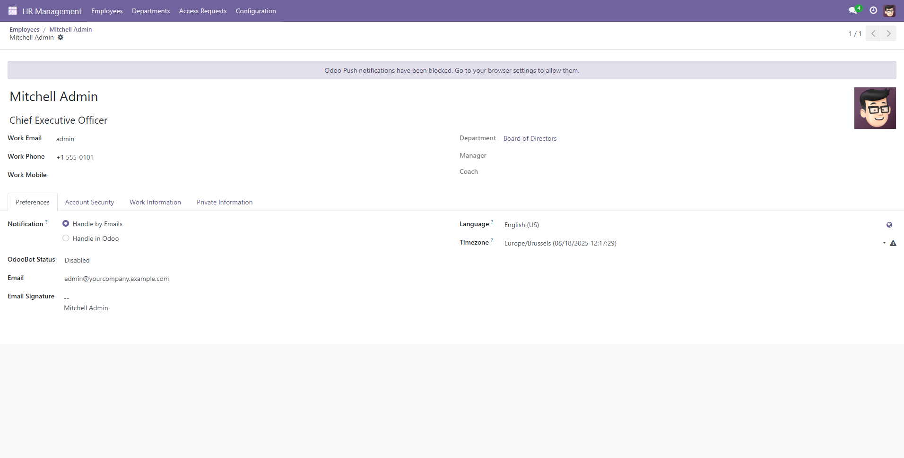
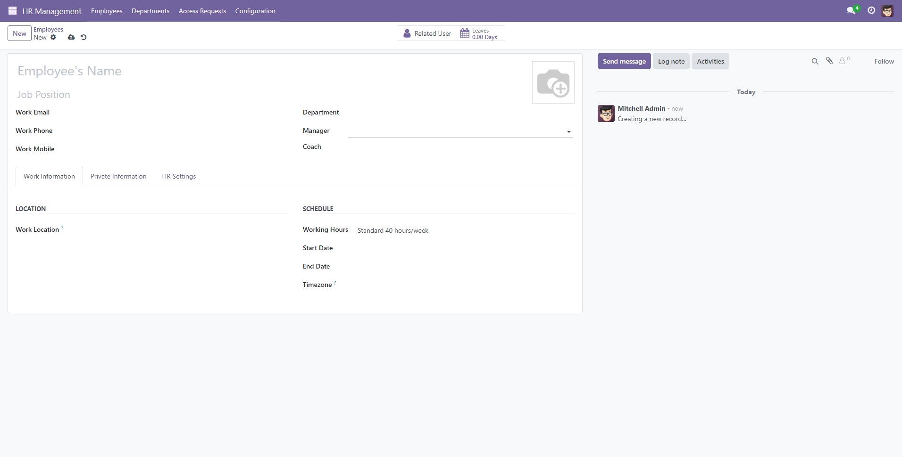
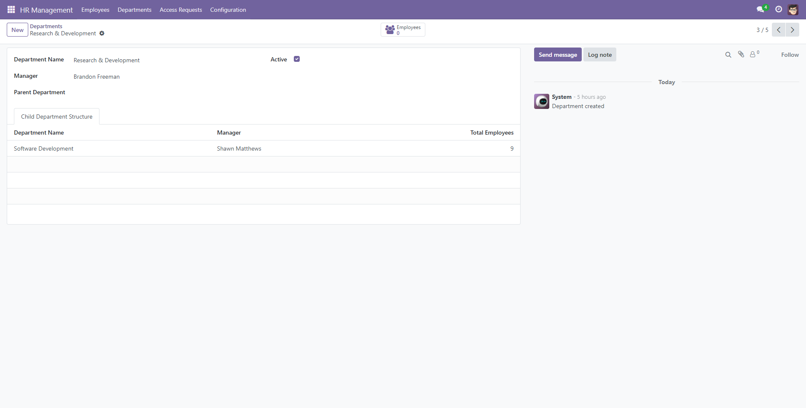
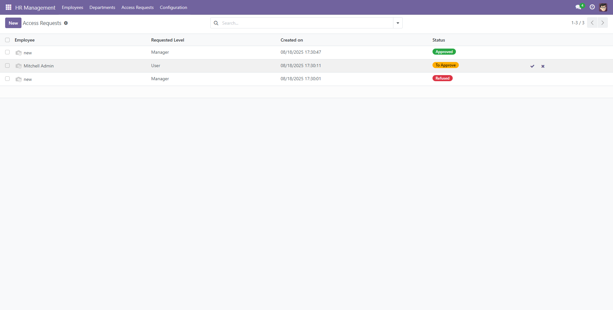
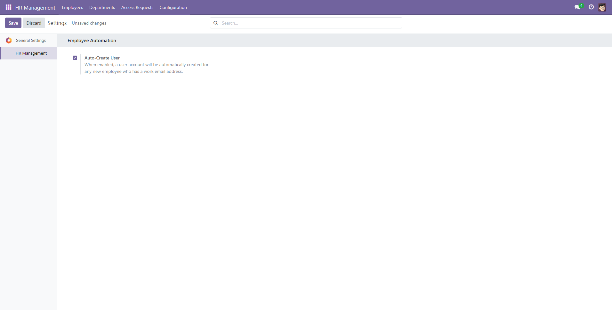

# Hướng dẫn Sử dụng - HR Management

Tài liệu này cung cấp hướng dẫn chi tiết về các quy trình nghiệp vụ chính trong module **HR Management**. Các hướng dẫn được chia theo vai trò và chức năng để người dùng có thể dễ dàng tìm thấy thông tin cần thiết.

## 1. Dành cho tất cả Nhân viên

### 1.1. Xem Danh bạ Công ty

Tất cả nhân viên đều có thể xem thông tin cơ bản của đồng nghiệp để tiện liên lạc và phối hợp công việc.

1.  **Truy cập:** Vào menu **HR Management -> Employees**.
2.  **Tìm kiếm:** Sử dụng thanh tìm kiếm để tìm nhân viên theo tên, hoặc sử dụng bộ lọc bên trái để lọc theo Phòng ban.
3.  **Xem thông tin:** Nhấn vào một nhân viên để xem các thông tin công khai như Tên, Vị trí, Phòng ban, Email và Điện thoại công việc.

### 1.2. Cập nhật Hồ sơ Cá nhân ("My Profile")

Mỗi nhân viên có thể tự cập nhật các thông tin cá nhân của mình.

1.  **Truy cập:** Nhấn vào avatar của bạn ở góc trên bên phải màn hình, sau đó chọn **My Profile**.
2.  **Cập nhật:** Bạn có thể thay đổi các thông tin như:
    - Ảnh đại diện.
    - Thông tin liên lạc cá nhân (Địa chỉ, Email, Điện thoại).
    - Thông tin nhân khẩu học (Ngày sinh, Giới tính, Quốc tịch).
    - Thông tin học vấn.
3.  **Lưu lại:** Nhấn **Save** để hoàn tất.

## 2. Dành cho Quản lý Nhân sự (HR Manager)

Quản lý Nhân sự có toàn quyền trên module để thực hiện các nghiệp vụ quản trị.

### 2.1. Quản lý Hồ sơ Nhân viên

#### a. Thêm một Nhân viên mới
1.  **Truy cập:** Vào menu **HR Management -> Employees**.
2.  **Tạo mới:** Nhấn nút **New**.
3.  **Nhập thông tin:**
    - **Thông tin bắt buộc:** *Employee Name*, *Work Email*, *Department*, *Job Position*.
    - **Thông tin quan trọng khác:** *Manager* (Quản lý trực tiếp), *Start Date*.
4.  **Liên kết User (Tab HR Settings):**
    - **Trường hợp 1 (Tự động):** Nếu tính năng "Auto-Create User" được bật trong Settings, chỉ cần điền *Work Email* và lưu lại, một tài khoản sẽ được tự động tạo và liên kết.
    - **Trường hợp 2 (Thủ công):** Nếu nhân viên đã có tài khoản Odoo, chọn tài khoản đó ở trường *User*.
5.  **Lưu lại:** Nhấn **Save**.

#### b. Chuyển trạng thái Nhân viên Nghỉ việc
1.  Mở hồ sơ của nhân viên cần cập nhật.
2.  Nhấn **Edit**.
3.  Tại tab **HR Settings**, thay đổi trường **Work Status** từ `Active` thành `Left`.
4.  Điền ngày nghỉ việc vào trường **End Date** (tab Work Information).
5.  Nhấn **Save**. Nhân viên sẽ được tự động archived (lưu trữ).

### 2.2. Quản lý Cơ cấu Tổ chức

#### a. Tạo và Cấu trúc Phòng ban
1.  **Truy cập:** Vào menu **HR Management -> Departments**.
2.  **Tạo mới:** Nhấn **New**.
3.  **Nhập thông tin:** Điền *Department Name*.
    - Để chuyển phòng sang dạng phòng ban con, hãy chọn phòng ban cha ở trường *Parent Department*.
4.  **Gán Trưởng phòng:** Chọn nhân viên tương ứng ở trường *Manager*.
5.  **Lưu lại.**
6.  **Xem nhân viên:** Từ form Phòng ban, nhấn vào smart button **Employees** để xem danh sách nhân viên thuộc phòng ban đó.

#### b. Tạo Vị trí Công việc
1.  **Truy cập:** Vào menu **HR Management -> Configuration -> Job Positions**.
2.  **Tạo mới:** Nhấn **New**.
3.  Điền **Job Position Name** và (tùy chọn) **Department**.
4.  **Lưu lại.**

### 2.3. Quy trình Phê duyệt Quyền Manager

Khi một nhân viên yêu cầu quyền Manager, Quản lý Nhân sự sẽ là người phê duyệt.

1.  **Nhận thông báo:** Hệ thống sẽ tạo một "Activity" (Hoạt động) trên biểu tượng đồng hồ, thông báo có yêu cầu mới.
2.  **Truy cập:** Vào menu **HR Management -> Access Requests**.
3.  **Xem xét:** Danh sách các yêu cầu đang ở trạng thái "To Approve" sẽ hiện ra.
4.  **Ra quyết định:**
    - Mở yêu cầu để xem chi tiết.
    - Nhấn **Approve** để đồng ý. Quyền Manager sẽ được tự động cấp cho người dùng.
    - Nhấn **Refuse** để từ chối.
    

## 3. Dành cho Quản trị viên Hệ thống (System Admin)

### 3.1. Cấu hình Module

Quản trị viên có thể tùy chỉnh một số hành vi mặc định của module.

1.  **Truy cập:** Vào menu **HR Management -> Configuration -> Settings**.
2.  **Tùy chọn:**
    - **Auto-Create User:** Tích vào ô này để kích hoạt tính năng tự động tạo tài khoản người dùng khi tạo nhân viên mới có email.
3.  **Lưu lại:** Nhấn **Save** để áp dụng cấu hình.

