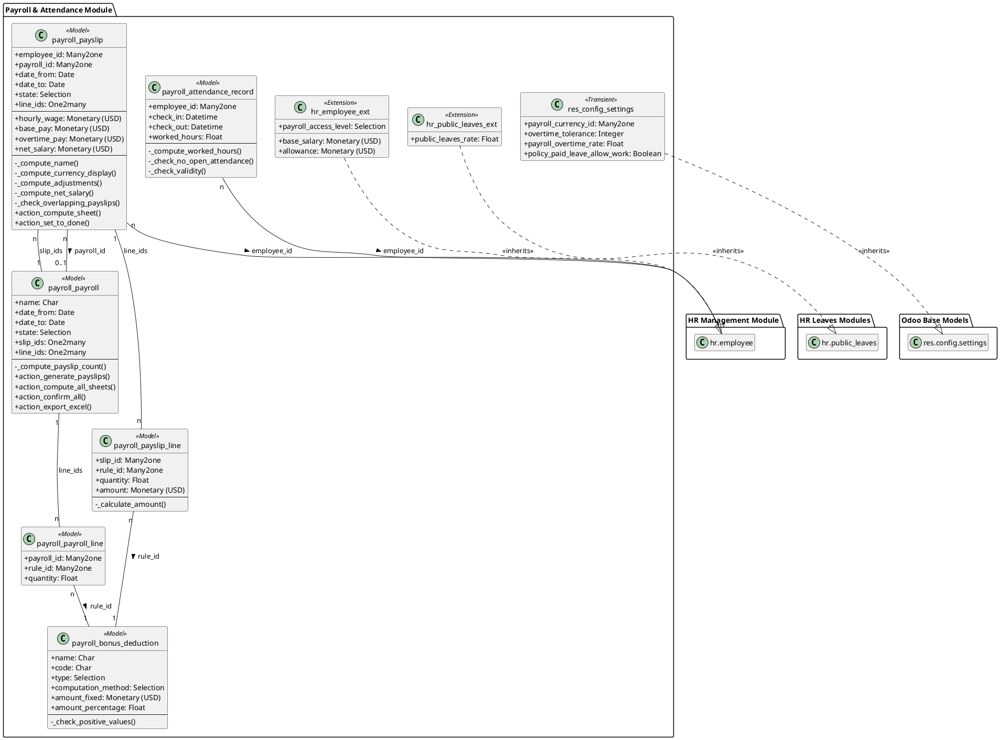

# Mô hình Dữ liệu - Payroll & Attendance

Tài liệu này phân tích chi tiết cấu trúc dữ liệu của module **Payroll & Attendance**, bao gồm các model, trường dữ liệu, mối quan hệ và các ràng buộc logic.

## 1. Sơ đồ Lớp UML (UML Class Diagram)

Sơ đồ dưới đây minh họa cấu trúc hướng đối tượng của các model trong module. Nó thể hiện rõ các thuộc tính (fields), phương thức (methods) quan trọng, các mối quan hệ và tính kế thừa.

**Chú thích:**
- `+` : Thuộc tính/Phương thức công khai (public).
- `-` : Thuộc tính/Phương thức riêng tư (private/protected), thường là các hàm `_compute`, `_check`, `_onchange`.
- `<<Model>>`: Biểu thị một model Odoo chuẩn.
- `<<Transient>>`: Biểu thị một model Odoo tạm thời (`models.TransientModel`).
- `(USD)`: Biểu thị trường Monetary lưu trữ bằng tiền tệ cơ sở USD.

## 2. Mô tả chi tiết các Model

### 2.1. Chấm công (`payroll.attendance.record`)
Lưu trữ các bản ghi vào-ra của nhân viên.

- **Các trường dữ liệu:**
  - `employee_id` (Many2one -> `hr.employee`): Nhân viên chấm công.
  - `check_in`, `check_out` (Datetime): Thời gian vào và ra.
  - `worked_hours` (Float): Số giờ làm việc (tính toán, store=True).
- **Phương thức & Ràng buộc Logic:**
  - `_compute_worked_hours`: Tính `worked_hours` khi `check_out` được điền.
  - `_check_no_open_attendance`: Ngăn một nhân viên `check-in` khi vẫn còn một bản ghi chấm công chưa `check-out`.
  - `_check_validity`: `check_out` phải sau `check_in`.

### 2.2. Quy tắc Thưởng/Khấu trừ (`payroll.bonus.deduction`)
Định nghĩa các quy tắc tính lương.

- **Các trường dữ liệu:**
  - `name`, `code` (Char): Tên và mã định danh.
  - `sequence` (Integer): Thứ tự ưu tiên khi tính toán.
  - `type` (Selection): `bonus` (cộng) hoặc `deduction` (trừ).
  - `computation_method` (Selection): `fixed` (số tiền cố định) hoặc `percentage` (phần trăm của lương gộp).
  - `currency_id` (Many2one -> `res.currency`): Trường kỹ thuật, luôn là USD.
  - `currency_display_id` (Many2one -> `res.currency`): Tiền tệ hiển thị, lấy từ cấu hình.
  - `amount_fixed` (Monetary): Số tiền cố định (lưu trữ bằng USD).
  - `amount_percentage` (Float): Tỷ lệ phần trăm.
  - `amount_fixed_display` (Monetary): Số tiền cố định (hiển thị theo `currency_display_id`).
- **Phương thức & Ràng buộc Logic:**
  - `_check_positive_values`: Các giá trị `amount` không được âm.
  - `_compute_currency`, `_compute_currency_display`: Lấy thông tin tiền tệ.
  - `_compute_amount_fixed_display`, `_inverse_amount_fixed_display`: Chuyển đổi giá trị giữa trường lưu trữ USD và trường hiển thị.

### 2.3. Phiếu lương (`payroll.payslip`)
Model trung tâm, chứa toàn bộ thông tin lương của một nhân viên trong một kỳ. Kế thừa `mail.thread` và `mail.activity.mixin`.

- **Các trường dữ liệu:**
  - **Thông tin chung:** `name`, `employee_id`, `date_from`, `date_to`, `state` (`draft`, `done`), `payroll_id` (Bảng lương).
  - **Thông tin tham chiếu:** `identification_id`, `department_id`, `resource_calendar_id`.
  - **Giờ làm việc (tính toán):**
    - `standard_work_hours`: Giờ làm việc tiêu chuẩn trong kỳ.
    - `actual_worked_hours`: Giờ làm việc thực tế (không tính OT, nghỉ lễ).
    - `paid_leaves_hours`: Giờ nghỉ phép có lương (không đi làm).
    - `overtime_hours`: Giờ làm thêm.
    - `public_leaves_worked_hours`: Giờ làm vào ngày nghỉ lễ.
    - `unpaid_leaves_hours`: Giờ nghỉ không lương (không đi làm).
  - **Trường lưu trữ (tính toán bằng USD):**
    - `currency_id` (Many2one): Luôn là USD.
    - `hourly_wage`: Mức lương theo giờ.
    - `base_pay`: Lương cơ bản dựa trên giờ làm thực tế và giờ nghỉ có lương.
    - `overtime_pay`: Lương làm thêm.
    - `public_leaves_pay`: Lương làm vào ngày nghỉ lễ.
    - `allowance`: Phụ cấp.
    - `total_bonus`, `total_deduction`: Tổng thưởng/phạt từ `line_ids`.
    - `gross_salary_before_adjustments`: Lương gộp trước thưởng/phạt.
    - `net_salary`: Lương thực nhận.
  - **Trường hiển thị (theo Tiền tệ cấu hình):**
    - `currency_display_id` (Many2one): Tiền tệ hiển thị.
    - `hourly_wage_display`, `base_pay_display`, `overtime_pay_display`, `public_leaves_pay_display`, `allowance_display`, `total_bonus_display`, `total_deduction_display`, `gross_salary_display`, `net_salary_display`.
  - **Chi tiết:** `line_ids` (One2many -> `payroll.payslip.line`).
- **Phương thức & Ràng buộc Logic:**
  - `_check_dates`, `_check_employee_contract_dates`, `_check_overlapping_payslips`: Các ràng buộc về tính hợp lệ của dữ liệu.
  - `_compute_name`, `_compute_currency_display`, `_compute_display_fields`, `_compute_adjustments`, `_compute_gross_salary`, `_compute_net_salary`: Các hàm tính toán tự động.
  - `action_compute_sheet`: Phương thức chính để thực hiện toàn bộ logic tính lương.
  - `action_set_to_done`, `action_reset_to_draft`: Các hành động thay đổi trạng thái.

### 2.4. Dòng Phiếu lương (`payroll.payslip.line`)
Chi tiết các khoản thưởng/phạt trên một phiếu lương.

- **Các trường dữ liệu:**
  - `slip_id` (Many2one -> `payroll.payslip`): Liên kết đến phiếu lương.
  - `rule_id` (Many2one -> `payroll.bonus.deduction`): Quy tắc được áp dụng.
  - `sequence` (Integer): Thứ tự tính toán (related từ `rule_id`).
  - `quantity` (Float): Số lượng/hệ số áp dụng.
  - `currency_id` (Many2one): Luôn là USD (related từ `slip_id`).
  - `currency_display_id` (Many2one): Tiền tệ hiển thị (related từ `slip_id`).
  - `amount` (Monetary): Số tiền tính được (lưu trữ bằng USD).
  - `amount_display` (Monetary): Số tiền (hiển thị theo `currency_display_id`).
- **Phương thức & Ràng buộc Logic:**
  - `_calculate_amount`: Tính giá trị `amount` dựa trên quy tắc và lương gộp hiện tại.
  - `_compute_amount_display`: Chuyển đổi `amount` sang tiền tệ hiển thị.

### 2.5. Bảng lương (`payroll.payroll`)
Quản lý việc tạo và xử lý phiếu lương hàng loạt. Kế thừa `mail.thread` và `mail.activity.mixin`.

- **Các trường dữ liệu:**
  - `name`, `date_from`, `date_to`, `state` (`draft`, `generated`, `done`).
  - `slip_ids` (One2many -> `payroll.payslip`): Danh sách phiếu lương được tạo ra.
  - `payslip_count` (Integer): Số lượng phiếu lương (tính toán).
  - `selection_mode` (Selection): `employee` (chọn theo nhân viên) hoặc `department` (chọn theo phòng ban).
  - `employee_ids`, `department_ids` (Many2many): Danh sách nhân viên/phòng ban được chọn.
  - `line_ids` (One2many -> `payroll.payroll.line`): Các dòng thưởng/phạt mẫu cho cả lô.
- **Phương thức & Ràng buộc Logic:**
  - `_check_dates`: `date_from` phải trước `date_to`.
  - `action_generate_payslips`, `action_compute_all_sheets`, `action_confirm_all`, `action_reset_to_draft`, `action_export_excel`, `action_view_payslips`: Các hành động chính trên lô.

### 2.6. Dòng Bảng lương (`payroll.payroll.line`)
Định nghĩa các dòng thưởng/phạt mẫu cho một Bảng lương.

- **Các trường dữ liệu:**
  - `payroll_id` (Many2one -> `payroll.payroll`): Liên kết đến Bảng lương.
  - `rule_id` (Many2one -> `payroll.bonus.deduction`): Quy tắc mẫu.
  - `quantity` (Float): Số lượng/hệ số mẫu.

### 2.7. Mở rộng Model có sẵn
- **Nhân viên (`hr.employee`):**
  - Thêm `base_salary`, `allowance` (Monetary, USD) và các trường `_display` tương ứng.
  - Thêm `payroll_access_level` để quản lý quyền.
  - Thêm phương thức `get_systray_info` và `action_manual_attendance` để phục vụ widget chấm công.
  - `_check_positive_salary`: Lương và phụ cấp không được âm.
- **Ngày nghỉ Lễ (`hr.public.leaves`):**
  - Thêm trường `public_leaves_rate` (Float) để định nghĩa hệ số nhân lương khi làm việc vào ngày lễ.
- **Cài đặt (`res.config.settings`):**
  - Thêm các tham số cấu hình: `payroll_currency_id`, `overtime_tolerance`, `undertime_tolerance`, `payroll_overtime_rate`, và các chính sách nghỉ phép.