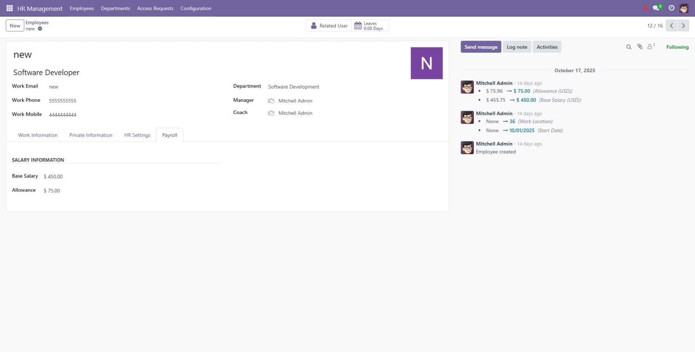
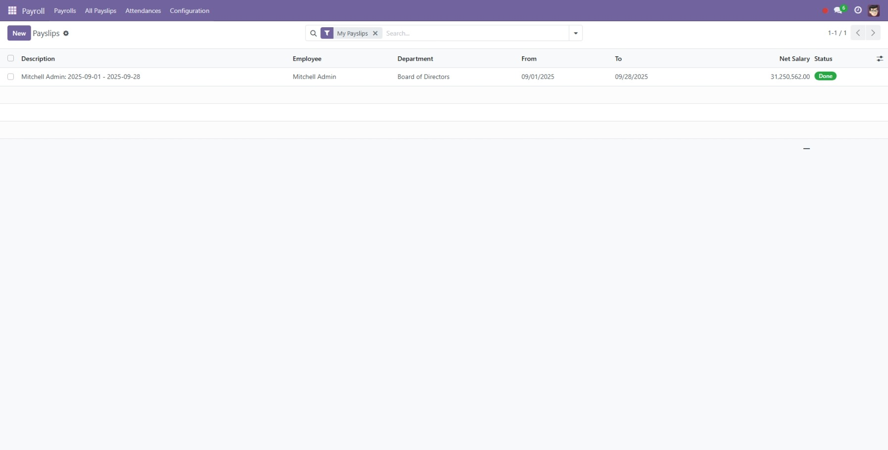
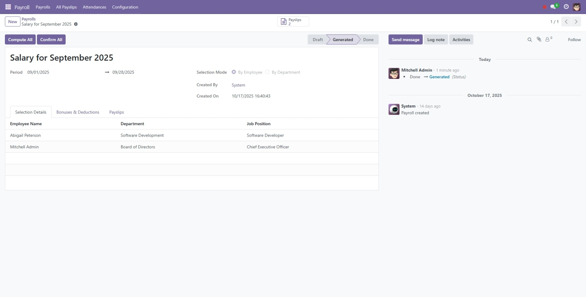

# Hướng dẫn Sử dụng - Payroll & Attendance

Tài liệu này cung cấp hướng dẫn chi tiết về các quy trình nghiệp vụ chính trong module **Payroll & Attendance**, từ cấu hình, chấm công hàng ngày đến chạy lương hàng tháng.

## 1. Dành cho Quản trị viên & Quản lý Nhân sự (Cấu hình ban đầu)

Các bước này cần được thực hiện trước khi chạy kỳ lương đầu tiên.

### 1.1. Cấu hình Hệ thống
1.  **Truy cập:** Vào menu **Payroll -> Configuration -> Settings**.
2.  **Thiết lập các tham số:**
    - **Payroll Currency:** Chọn loại tiền tệ chính sẽ hiển thị trên tất cả giao diện.
    - **Overtime Tolerance:** Đặt số phút dung sai trước khi giờ làm được tính là làm thêm (OT).
    - **Overtime Rate:** Đặt hệ số nhân lương cho giờ làm thêm (ví dụ: 1.5 cho 150%).
    - **Leave Policies:** Cấu hình các chính sách xử lý khi nhân viên đi làm trong ngày nghỉ phép.
3.  **Lưu lại.**

### 1.2. Định nghĩa Quy tắc Thưởng/Khấu trừ
1.  **Truy cập:** Vào menu **Payroll -> Configuration -> Bonus/Deduction Rules**.
2.  **Tạo mới:** Giao diện cho phép tạo và sửa trực tiếp trên danh sách.
3.  **Điền thông tin:**
    - **Name & Code:** Tên và mã quy tắc (ví dụ: "Thưởng KPI", "KPI_BONUS").
    - **Type:** Chọn `Bonus` (cộng vào lương) hoặc `Deduction` (trừ khỏi lương).
    - **Computation Method:** Chọn `Fixed Amount` hoặc `Percentage of Gross Salary`.
    - **Amount:** Điền số tiền hoặc tỷ lệ phần trăm tương ứng.
4.  **Lưu lại.**

### 1.3. Cập nhật Lương cho Nhân viên
1.  **Truy cập:** Vào menu **HR Management -> Employees**, mở hồ sơ nhân viên.
2.  **Vào tab Payroll:**
    - **Base Salary:** Nhập mức lương cơ bản hàng tháng.
    - **Allowance:** Nhập các khoản phụ cấp cố định hàng tháng.
3.  **Lưu lại.**

## 2. Dành cho tất cả Nhân viên (Hàng ngày)

### 2.1. Chấm công (Check-in / Check-out)
1.  **Sử dụng Systray:** Trên thanh công cụ trên cùng của Odoo, tìm biểu tượng chấm công (hình tròn).
    - **Màu đỏ:** Bạn đã `checked out`.
    - **Màu xanh:** Bạn đã `checked in`.
2.  **Thực hiện:**
    - Nhấn vào biểu tượng, sau đó chọn **Check In** khi bắt đầu làm việc.
    - Nhấn vào biểu tượng, sau đó chọn **Check Out** khi kết thúc làm việc.

### 2.2. Xem Lịch sử Chấm công và Phiếu lương
- **Xem Chấm công:**
  1.  **Truy cập:** Vào menu **Payroll -> Attendances**.
  2.  Sử dụng bộ lọc **My Attendances** để xem các bản ghi chấm công của bạn.

- **Xem Phiếu lương:**
  1.  **Truy cập:** Vào menu **Payroll -> All Payslips**.
  2.  Sử dụng bộ lọc **My Payslips** để xem các phiếu lương của bạn đã được phòng nhân sự xác nhận.

## 3. Dành cho Quản lý Nhân sự (Hàng tháng)

Đây là quy trình chính để tính và trả lương cho nhân viên.

### 3.1. Tạo Bảng lương (`payroll.payroll`)
1.  **Truy cập:** Vào menu **Payroll -> Payrolls**.
2.  **Tạo mới:** Nhấn **New**.
3.  **Điền thông tin cơ bản:**
    - **Name:** Tên của Bảng lương (ví dụ: "Lương tháng 08/2025").
    - **Period:** Chọn ngày bắt đầu và kết thúc của kỳ lương.
4.  **Chọn Nhân viên:**
    - **Selection Mode:** Chọn `By Department` (để chọn cả phòng ban) hoặc `By Employee` (để chọn từng nhân viên).
    - Chọn các phòng ban hoặc nhân viên tương ứng.
5.  **(Tùy chọn) Thêm Thưởng/Phạt chung:** Vào tab **Bonuses & Deductions** để thêm các quy tắc sẽ áp dụng cho tất cả mọi người trong Bảng lương này.
6.  **Lưu lại.**

### 3.2. Xử lý và Hoàn tất Bảng lương
1.  **Tạo Phiếu lương:** Mở Bảng lương vừa tạo và nhấn nút **Generate Payslips**. Hệ thống sẽ tạo các phiếu lương con ở trạng thái `draft`.
2.  **(Tùy chọn) Điều chỉnh cá nhân:** Nhấn vào smart button **Payslips** để xem danh sách. Mở từng phiếu lương để thêm các khoản thưởng/phạt riêng cho từng người nếu cần.
3.  **Tính toán:** Quay lại form Bảng lương, nhấn **Compute All**. Hệ thống sẽ chạy logic tính lương cho tất cả các phiếu lương.
4.  **Xác nhận:** Sau khi đã kiểm tra, nhấn **Confirm All**. Tất cả phiếu lương sẽ chuyển sang trạng thái `done` và khóa lại.
5.  **Xuất Báo cáo:** Nhấn **Export Excel** để tải về file báo cáo lương của cả Bảng lương.

